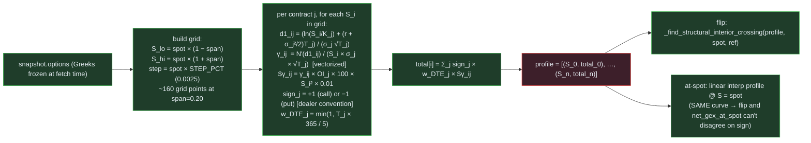
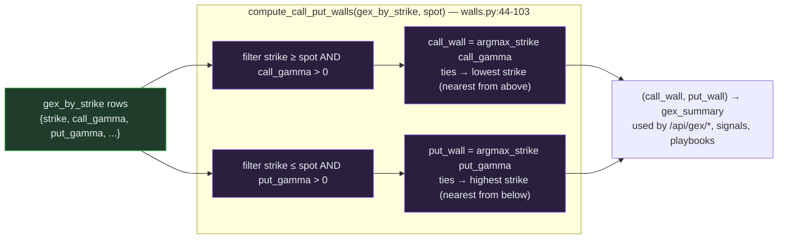
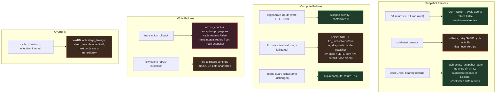

# Analytics Engine — Architecture Diagram

This document diagrams how the Analytics Engine works end-to-end. The engine
reads the latest option chain produced by Ingestion, computes per-strike
dealer gamma / vanna / charm exposures, resolves the gamma flip via an
adaptive multi-rung bracket-and-verify algorithm, computes call/put walls
and max-pain, and persists results to `gex_summary`, `gex_by_strike`,
`flow_by_contract`, `flow_smart_money`, and `flow_series_5min`.

Sources mapped: `src/analytics/main_engine.py`, `src/analytics/walls.py`,
`src/flow_series_sql.py`, `src/signals/**`, `src/config.py`,
`src/market_calendar.py`.

---

## 1. Top-Level Architecture

```mermaid
flowchart TB
    classDef proc fill:#2a1f3d,stroke:#a371f7,color:#e6edf3
    classDef compute fill:#1f3d2a,stroke:#3fb950,color:#e6edf3
    classDef gate fill:#3d2a1f,stroke:#f0883e,color:#e6edf3
    classDef db_r fill:#1a2733,stroke:#5b8def,color:#e6edf3
    classDef db_w fill:#3d1f2a,stroke:#f85149,color:#e6edf3
    classDef out fill:#2a2a2a,stroke:#8b949e,color:#e6edf3
    classDef cfg fill:#2a2a2a,stroke:#8b949e,color:#e6edf3,stroke-dasharray:3 3

    %% ============ PROCESS TREE ============
    subgraph PROC["Process Tree (multiprocessing)"]
        direction TB
        MAIN["main()<br/>main_engine.py:2891-2938<br/>parse ANALYTICS_UNDERLYINGS<br/>spawn 1 Process per symbol<br/>SIGINT/SIGTERM handlers"]:::proc
        WSPY["AnalyticsEngine('SPY').run()<br/>:2736-2846<br/>continuous loop, off-hours aware"]:::proc
        WSPX["AnalyticsEngine('SPX').run()"]:::proc
        WQQQ["AnalyticsEngine('QQQ').run()"]:::proc
        MAIN --> WSPY
        MAIN --> WSPX
        MAIN --> WQQQ
    end

    %% ============ RUN LOOP ============
    subgraph LOOP["Run Loop (single symbol)"]
        direction TB
        WIN["is_engine_run_window()<br/><i>market_calendar</i>"]:::gate
        MODE{"RTH? off-hours enabled?"}:::gate
        SLEEP_OFF["sleep until next RTH window<br/>(off_hours_enabled=false)"]:::compute
        INT_RTH["effective_interval = calculation_interval<br/>(default 60s)"]:::compute
        INT_OFF["effective_interval = off_hours_interval<br/>(default 300s)"]:::compute
        CYCLE["run_calculation()<br/>:2524-2734"]:::compute
        TIME_ACC["measure cycle_duration<br/>sleep max(0, interval − duration)"]:::compute
        OVERRUN["WARN if duration &gt; interval<br/>log slowest stage"]:::gate

        WIN --> MODE
        MODE -- "RTH" --> INT_RTH --> CYCLE
        MODE -- "off-hours + enabled" --> INT_OFF --> CYCLE
        MODE -- "off-hours + disabled" --> SLEEP_OFF --> WIN
        CYCLE --> TIME_ACC --> OVERRUN --> WIN
    end

    %% ============ PIPELINE ============
    subgraph PIPE["run_calculation() Pipeline (8 stages)"]
        direction TB

        S1["STAGE 1: _get_snapshot()<br/>:261-569"]:::compute
        S2["STAGE 2: validation &amp; dedup<br/>:2562-2624<br/>last_processed_snapshot_ts guard<br/>empty-snapshot latch"]:::gate
        S3["STAGE 3: _calculate_gex_by_strike()<br/>:690-865"]:::compute
        S4["STAGE 4: _calculate_gex_summary()<br/>:1584-1781"]:::compute
        S5["STAGE 5: _validate_gex_calculations()<br/>:2037-2071<br/>by-strike formula check<br/>aggregation consistency"]:::gate
        S6["STAGE 6: _store_calculation_results()<br/>:2008-2035<br/>atomic transaction"]:::compute
        S7["STAGE 7: _refresh_flow_caches()<br/>:2188-2457<br/>best-effort, isolated try/except"]:::compute
        S8["STAGE 8: metrics &amp; logging<br/>per-stage timings"]:::compute

        S1 --> S2 --> S3 --> S4 --> S5 --> S6 --> S7 --> S8
    end

    %% ============ SNAPSHOT DETAIL ============
    subgraph SNAP["Stage 1: Snapshot (3 queries)"]
        direction TB
        Q1["Q1 — latest timestamp<br/>SELECT timestamp<br/>FROM option_chains<br/>WHERE underlying=? ORDER BY timestamp DESC LIMIT 1"]:::compute
        Q2["Q2 — underlying price<br/>SELECT close<br/>FROM underlying_quotes<br/>WHERE symbol=? AND timestamp&lt;=? ORDER BY timestamp DESC LIMIT 1"]:::compute
        Q3["Q3 — per-contract DISTINCT ON<br/>SELECT DISTINCT ON (option_symbol)<br/>strike, expiration, type, last, bid, ask, vol, OI,<br/>delta, gamma, theta, vega, IV, timestamp<br/>FROM option_chains<br/>WHERE underlying=? AND timestamp&lt;=? AND timestamp&gt;=? AND expiration&gt;? AND gamma IS NOT NULL<br/>LIMIT ANALYTICS_SNAPSHOT_MAX_ROWS (50000)"]:::compute

        COLD{"cold-start?<br/>(first cycle &amp; data &gt;2h old)"}:::gate
        WIDE["lookback = COLD_START_LOOKBACK_HOURS (96h)<br/>SET LOCAL statement_timeout = 180000<br/>Parallel Bitmap Heap Scan path"]:::compute
        STEADY["lookback = SNAPSHOT_LOOKBACK_HOURS (2h)<br/>Index Scan + in-memory sort path"]:::compute
        FALLBACK["cold-start failed → retry SAME cycle with 2h fallback<br/>flag flips on first attempt; never loops"]:::gate

        AM["SPX AM-settled drop<br/>if ts &gt;= 09:30 ET and exp==today<br/>and is_spx_am_settled_expiration()<br/>(third-Friday monthly only; SPXW skipped)"]:::gate
        OICOV["OI coverage alert<br/>if %OI&gt;0 &lt; ANALYTICS_MIN_OI_COVERAGE_PCT_ALERT (0.35)<br/>→ WARN (ingestion lag)"]:::gate

        Q1 --> Q2 --> COLD
        COLD -- "yes" --> WIDE --> Q3
        COLD -- "no" --> STEADY --> Q3
        WIDE -. "timeout / fail" .-> FALLBACK --> STEADY
        Q3 --> AM --> OICOV
    end

    %% ============ GEX BY STRIKE ============
    subgraph GEXBS["Stage 3: GEX by Strike (per-row math)"]
        direction TB
        GRP["group by (strike, expiration)<br/>data[key] = {calls:[], puts:[]}"]:::compute
        CGM["call_gamma = Σ γ × OI<br/>call_gex = +call_gamma × 100 × S² × 0.01"]:::compute
        PGM["put_gamma = Σ γ × OI<br/>put_gex = −put_gamma × 100 × S² × 0.01<br/>(dealer sign convention)"]:::compute
        VAN["vanna_exposure (per contract):<br/>vanna_$ = vanna × OI × 100 × S × 0.01<br/>($ per 1 vol point)"]:::compute
        CHM["charm_exposure (per contract):<br/>charm_$ = charm × OI × 100 × S<br/>(already /day)"]:::compute
        DEAL["dealer_vanna_exposure = −vanna_exposure<br/>dealer_charm_exposure = −charm_exposure"]:::compute
        BUCK["expiration_bucket<br/>0DTE / weekly (≤7d) / monthly (≤45d) / leaps"]:::compute
        ROW["row = {underlying, ts, strike, expiration,<br/>total_gamma, call_gamma, put_gamma, net_gex,<br/>call_volume, put_volume, call_oi, put_oi,<br/>vanna_exposure, charm_exposure,<br/>call_vanna_exposure, put_vanna_exposure,<br/>call_charm_exposure, put_charm_exposure,<br/>dealer_vanna_exposure, dealer_charm_exposure,<br/>expiration_bucket}"]:::out

        GRP --> CGM --> PGM
        PGM --> VAN --> CHM --> DEAL --> BUCK --> ROW
    end

    %% ============ SUMMARY ============
    subgraph SUM["Stage 4: GEX Summary"]
        direction TB
        MAX_G["max_gamma_strike<br/>argmax_strike |Σ_expirations net_gex|"]:::compute
        FLIP["gamma flip resolver<br/>(see diagram §3 below)"]:::compute
        NGAS["net_gex_at_spot<br/>piecewise-linear sample of SAME profile at S<br/>guarantees flip and at-spot sign agree"]:::compute
        MP["max_pain per-expiration<br/>:1698-1712<br/>argmin_strike total_payout<br/>headline = front-month;<br/>full dict → max_pain_by_expiration JSONB"]:::compute
        WALLS["compute_call_put_walls()<br/><i>walls.py:44-103</i><br/>call_wall: max(call_gamma) where strike ≥ spot, ties → lowest<br/>put_wall:  max(put_gamma)  where strike ≤ spot, ties → highest"]:::compute
        METRICS["put_call_ratio, total_net_gex,<br/>flip_distance = (spot−flip)/spot,<br/>local_gex = Σ |net_gex| within ±1% of spot,<br/>convexity_risk = |total_net_gex| / max(|flip_distance|, 1e-6)"]:::compute
        CARRY["carry-forward logic<br/>:1885-1905<br/>flip NULL AND not gamma_flip_unresolved → use prior non-NULL<br/>flip NULL AND gamma_flip_unresolved → persist NULL (honest signal)"]:::gate

        MAX_G --> FLIP --> NGAS --> MP --> WALLS --> METRICS --> CARRY
    end

    %% ============ FLOW CACHES ============
    subgraph FLOW["Stage 7: Flow Caches (best-effort)"]
        direction TB
        F1["flow_by_contract (5-min, day-to-date cumulative)<br/>:2213-2307<br/>aggregates flow_contract_facts from 09:30 ET<br/>upserts current + previous 5-min bucket<br/>HAVING SUM(volume_delta)&gt;0"]:::compute
        F2["flow_smart_money (unusual activity)<br/>:2308-2446<br/>tiers from component_normalizer_cache p95 (vol &amp; prem)<br/>or static cold-start tiers<br/>score = vol_tier + prem_tier + iv_tier (≤10)<br/>retention 7d (DELETE &gt; NOW() − 7 days)"]:::compute
        F3["flow_series_5min<br/>:2462-2522<br/>materializes /api/flow/series CTE<br/>(flow_series_sql.py canonical CTE)<br/>columns: bar_start, call/put premium &amp; volume cum,<br/>net_volume/raw_volume/net_premium cum,<br/>put_call_ratio, underlying_price, contract_count, is_synthetic<br/>idempotent: closed bars are final"]:::compute
    end

    %% ============ DATABASE I/O ============
    subgraph DB_READ["Reads"]
        direction TB
        R1[("option_chains<br/>quotes + Greeks")]:::db_r
        R2[("underlying_quotes<br/>spot close")]:::db_r
        R3[("flow_contract_facts<br/>raw classified flow")]:::db_r
        R4[("component_normalizer_cache<br/>p95 calibration")]:::db_r
    end

    subgraph DB_WRITE["Writes"]
        direction TB
        W1[("gex_by_strike<br/>PK (underlying, ts, strike, expiration)<br/>UPSERT where IS DISTINCT FROM")]:::db_w
        W2[("gex_summary<br/>PK (underlying, ts)<br/>max_pain_by_expiration JSONB<br/>gamma_flip_span_used, gamma_flip_unresolved<br/>call_wall, put_wall, net_gex_at_spot")]:::db_w
        W3[("flow_by_contract<br/>PK (ts, sym, type, strike, exp)")]:::db_w
        W4[("flow_smart_money<br/>PK (ts, sym, option_symbol)")]:::db_w
        W5[("flow_series_5min<br/>PK (symbol, bar_start)")]:::db_w
    end

    %% ============ DOWNSTREAM CONSUMERS ============
    subgraph DOWN["Downstream Consumers"]
        direction TB
        API["REST API (src/api/*)<br/>/api/gex/summary<br/>/api/gex/history<br/>/api/gex/by-strike<br/>/api/gex/heatmap<br/>/api/flow/series<br/>/api/flow/smart-money<br/>/api/signals/score<br/>/api/signals/action"]:::out
        UNIFIED["UnifiedSignalEngine<br/>src/signals/unified_signal_engine.py<br/>blends 6 basic signals → MSI<br/>runs 7 advanced signals"]:::out
        PLAY["Playbook Engine<br/>src/signals/playbook/engine.py<br/>pattern matchers → Action Card"]:::out
        PORT["Portfolio Engine<br/>src/signals/portfolio_engine.py"]:::out
    end

    %% ============ CONFIG ============
    subgraph CFG["Configuration (src/config.py)"]
        direction TB
        CFG_BODY["ANALYTICS_INTERVAL=60s<br/>ANALYTICS_OFF_HOURS_INTERVAL_SECONDS=300s<br/>ANALYTICS_OFF_HOURS_ENABLED=true<br/>ANALYTICS_SNAPSHOT_LOOKBACK_HOURS=2<br/>ANALYTICS_SNAPSHOT_COLD_START_LOOKBACK_HOURS=96<br/>ANALYTICS_SNAPSHOT_COLD_START_STATEMENT_TIMEOUT_MS=180000<br/>ANALYTICS_SNAPSHOT_MAX_ROWS=50000<br/>ANALYTICS_MIN_OI_COVERAGE_PCT_ALERT=0.35<br/>ANALYTICS_FLOW_CACHE_REFRESH_ENABLED=true<br/>FLOW_CACHE_REFRESH_MIN_SECONDS=15<br/><br/>RISK_FREE_RATE=0.05<br/><br/>──────────────────<br/>GAMMA_FLIP_PROFILE=default | strict | lenient<br/>(recommended entry point — bundles all 11 knobs below)<br/>──────────────────<br/>GAMMA_PROFILE_SPAN_PCT=0.20<br/>GAMMA_PROFILE_STEP_PCT=0.0025<br/>GAMMA_PROFILE_EXPANSION_RUNGS=[0.35, 0.50]<br/>GAMMA_PROFILE_INTERIOR_MARGIN=0.10<br/>GAMMA_PROFILE_STRUCTURAL_MIN_FRAC=0.02<br/>GAMMA_PROFILE_STRUCTURAL_WINDOW_PCT=0.01<br/>GAMMA_PROFILE_STRUCTURAL_REFERENCE_PERCENTILE=90.0<br/>GAMMA_PROFILE_STRUCTURAL_REFERENCE_SPAN_PCT=0.15<br/>GAMMA_PROFILE_STRUCTURAL_ACTIVE_DISTANCE_PCT=0.01<br/>GAMMA_PROFILE_MAX_FLIP_DISTANCE_PCT=0.08<br/>GAMMA_PROFILE_DTE_WEIGHTING=true<br/>GAMMA_PROFILE_DTE_REF_DAYS=5.0<br/><br/>SMART_MONEY_VOL_T1..T4=50/100/200/500<br/>SMART_MONEY_PREM_T1..T4=1x/2x/5x/10x notional<br/>SMART_MONEY_IV_INCL_DEFAULT=0.4<br/>SMART_MONEY_DEEP_OTM_DELTA_DEFAULT=0.15"]:::cfg
    end

    %% ============ WIRING ============
    LOOP --> PIPE

    S1 --> Q1
    Q1 -.SELECT.-> R1
    Q2 -.SELECT.-> R2
    Q3 -.SELECT.-> R1

    S3 --> GRP
    S4 --> MAX_G

    S6 -.UPSERT.-> W1
    S6 -.UPSERT.-> W2

    S7 --> F1
    S7 --> F2
    S7 --> F3
    F1 -.SELECT.-> R3
    F1 -.UPSERT.-> W3
    F2 -.SELECT.-> R3
    F2 -.SELECT.-> R4
    F2 -.UPSERT.-> W4
    F3 -.UPSERT.-> W5

    W2 -.read.-> API
    W1 -.read.-> API
    W3 -.read.-> API
    W4 -.read.-> API
    W5 -.read.-> API

    W2 --> UNIFIED
    W1 --> UNIFIED
    W3 --> UNIFIED
    UNIFIED --> PLAY
    PLAY --> PORT

    CFG_BODY -.governs.-> LOOP
    CFG_BODY -.governs.-> PIPE
```



---

## 2. Cycle Sequence (steady-state vs cold-start)

```mermaid
sequenceDiagram
    autonumber
    participant L as Run Loop
    participant E as AnalyticsEngine
    participant DB as PostgreSQL
    participant W as walls.py
    participant SS as flow_series_sql
    participant API as REST API / signals

    L->>E: run_calculation()
    E->>DB: Q1 SELECT timestamp FROM option_chains
    DB-->>E: latest_ts

    alt no rows
        E-->>L: return False (next cycle retries)
    end

    E->>DB: Q2 SELECT close FROM underlying_quotes
    DB-->>E: underlying_price

    alt cold-start (first cycle, data &gt;2h old, flag=False)
        E->>E: set flag=True (one-shot)
        E->>DB: SET LOCAL statement_timeout=180000
        E->>DB: Q3 with lookback=96h
        alt timeout / fail
            DB-->>E: error
            E->>DB: Q3 retry with lookback=2h
            DB-->>E: rows
        end
    else steady-state
        E->>DB: Q3 with lookback=2h
        DB-->>E: rows
    end

    E->>E: drop SPX AM-settled if ts≥09:30 ET &amp; exp==today
    E->>E: WARN if %OI&gt;0 &lt; 0.35

    alt timestamp unchanged since last cycle
        E-->>L: skip recompute (dedup guard); return True
    end
    alt zero Greek-bearing options
        E->>E: latch empty_snapshot_state; log once
        E-->>L: return True
    end

    E->>E: STAGE 3 _calculate_gex_by_strike (group by strike,exp)
    E->>E: STAGE 4 _calculate_gex_summary
    E->>E:   max_gamma_strike (cross-expiry agg)
    E->>E:   _resolve_gamma_flip (see §3)
    E->>E:   net_gex_at_spot (sample same profile at S)
    E->>E:   _calculate_max_pain_by_expiration
    E->>W: compute_call_put_walls(gex_by_strike, spot)
    W-->>E: (call_wall, put_wall)
    E->>E:   metrics: PCR, total_net_gex, flip_distance, local_gex, convexity_risk

    E->>E: STAGE 5 _validate_gex_calculations

    E->>DB: BEGIN
    E->>DB: UPSERT gex_by_strike (IS DISTINCT FROM)
    E->>DB: UPSERT gex_summary (carry-forward flip if NULL &amp; not unresolved)
    E->>DB: COMMIT

    E->>E: STAGE 7 _refresh_flow_caches (best-effort)
    E->>DB: UPSERT flow_by_contract (curr + prev 5-min bucket)
    E->>DB: UPSERT flow_smart_money; DELETE rows &gt; 7d
    E->>SS: SNAPSHOT_UPSERT_PSYCOPG2 (canonical CTE)
    SS->>DB: UPSERT flow_series_5min (idempotent closed bars)

    E->>E: log per-stage timings; WARN if cycle_duration &gt; interval
    E-->>L: return True
    L->>L: sleep max(0, interval − duration)
```

---

## 3. Gamma Flip Resolver (adaptive ladder + 3 gates)

The flip is **not** just "where call OI = put OI". It is the zero crossing
of the **spot-shift dealer gamma exposure profile**, found by:

1. Walking a **span ladder** (start ±20%, expand to ±35%, ±50%) until a
   crossing passes all three gates (interior, structural, actionable).
2. The structural reference is computed **once per cycle** from a fixed
   canonical band (±15% of spot), considering only grid points within
   ±1% of an active strike. The p90 of this band is the structural floor.
3. When the first ladder rung is at least as wide as the reference span
   (the default: rung 0 = ±20%, reference = ±15%), the reference is
   **sliced from the first rung's profile** rather than building a
   separate ±15% profile. This saves ~half of the per-cycle resolver
   compute without changing the reference's value.

```mermaid
flowchart TB
    classDef step fill:#1f3d2a,stroke:#3fb950,color:#e6edf3
    classDef gate fill:#3d2a1f,stroke:#f0883e,color:#e6edf3
    classDef bad fill:#3d1f2a,stroke:#f85149,color:#e6edf3
    classDef ok fill:#1a2733,stroke:#5b8def,color:#e6edf3

    START["enter _resolve_gamma_flip(options, spot, ts)"]:::step
    INIT["structural_reference = None<br/>(computed lazily on first valid rung)"]:::step

    RUNG["select span from ladder:<br/>[GAMMA_PROFILE_SPAN_PCT=0.20]<br/>then GAMMA_PROFILE_EXPANSION_RUNGS=[0.35, 0.50]"]:::step

    PROF["_gamma_exposure_profile(options, spot, ts, span_pct)<br/>grid = arange(S±span, step=S×STEP_PCT=0.0025)<br/>for each contract:<br/>  γ(S_i) via vectorized Black-Scholes (σ sticky-strike)<br/>  dollar_γ = γ(S_i) × OI × 100 × S_i² × 0.01<br/>  sign = +1 (call) or −1 (put)<br/>  w_DTE = min(1, DTE_days / DTE_REF_DAYS=5)<br/>  total[i] += sign × w_DTE × dollar_γ<br/>return [(S_i, total_i), ...]"]:::step

    REFCHK{"structural_reference still None?"}:::gate
    REF_SLICE["_structural_reference_from_profile()<br/>slice current rung's profile to ±15% band<br/>(rung is a superset, so no rebuild needed)<br/>filter to grid pts within ±1% of an active strike<br/>structural_floor = p90 of filtered |values|"]:::step
    REF_BUILD["_structural_reference() — fallback<br/>(rare: only when first rung &lt; 15%)<br/>builds a separate ±15% profile"]:::step
    RUNG_GE_REF{"span_pct &gt;= STRUCTURAL_REFERENCE_SPAN_PCT (0.15)?"}:::gate

    CROSS["walk adjacent pairs; collect sign changes<br/>linear interpolation to zero:<br/>candidate = S_i + (S_{i+1}−S_i) × (−c_i)/(c_{i+1}−c_i)"]:::step

    G1{"INTERIOR GATE<br/>candidate within [grid_lo + 10%·width,<br/>                 grid_hi − 10%·width]?"}:::gate
    G2{"STRUCTURAL GATE<br/>max |profile| in [candidate ± 1%]<br/>≥ STRUCTURAL_MIN_FRAC (0.02) × structural_floor?"}:::gate
    G3{"ACTIONABLE GATE<br/>|candidate − spot| / spot ≤ MAX_FLIP_DISTANCE_PCT (0.08)?"}:::gate

    PICK["among passing candidates,<br/>return the one NEAREST to spot"]:::ok

    NEXT{"more rungs in ladder?"}:::gate
    UNRES["all rungs exhausted<br/>flip = None; gamma_flip_unresolved = True<br/>log diagnostics:<br/>  usable_total / usable_calls / usable_puts<br/>  iv_p10/p50/p90/max, iv_at_default_share<br/>  oi_share by DTE bucket, weighted_oi_share<br/>  profile_peak/median/reference/pos/neg/zero pts"]:::bad

    DONE["persist:<br/>gamma_flip_point = pick (or NULL)<br/>gamma_flip_span_used = span (or NULL)<br/>gamma_flip_unresolved = bool"]:::ok

    START --> INIT --> RUNG --> PROF --> REFCHK
    REFCHK -- "no (already set)" --> CROSS
    REFCHK -- "yes (first valid rung)" --> RUNG_GE_REF
    RUNG_GE_REF -- "yes" --> REF_SLICE --> CROSS
    RUNG_GE_REF -- "no" --> REF_BUILD --> CROSS
    CROSS --> G1
    G1 -- "fail" --> NEXT
    G1 -- "pass" --> G2
    G2 -- "fail" --> NEXT
    G2 -- "pass" --> G3
    G3 -- "fail" --> NEXT
    G3 -- "pass" --> PICK --> DONE
    NEXT -- "yes" --> RUNG
    NEXT -- "no"  --> UNRES --> DONE
```



### Why each gate exists

| Gate | Failure Mode It Prevents |
|------|-------------------------|
| **Interior** (10% margin from grid edges) | End-of-scan artifacts where BS gamma decays to ~0 and noise causes spurious sign flips |
| **Structural** (peak ≥ 2% of p90 active-strike floor) | "Noise-floor" crossings where the profile slowly drifts through zero with all gammas decayed — looks like a flip but is just numerical drift |
| **Actionable** (≤8% from spot) | Flip far in the wings is mathematically real but useless on a tradeable horizon; better to report unresolved than mislead |

### Why DTE-weighting matters

Without it, a single 0DTE strike with massive same-day gamma can pin the
multi-day regime boundary to a strike that won't exist tomorrow.

$$w_{\text{DTE}} = \min\!\left(1.0,\; \frac{T \cdot 365}{\text{DTE\_REF\_DAYS}}\right)$$

→ 0DTE contributions decay toward zero; longer-dated contracts weight 1.0.

---

## 4. Spot-Shift Gamma Profile (the curve we sample)



---

## 5. Walls (single source of truth)



> Note: monotone in OI-weighted gamma alone — multiplying by
> `100·S²·0.01` doesn't change ordering, so the implementation orders by raw
> `call_gamma` / `put_gamma` and only computes dollar GEX when persisting
> per-strike rows.

---

## 6. Signals & Playbook Consumption

```mermaid
flowchart TB
    classDef out fill:#2a1f3d,stroke:#a371f7,color:#e6edf3
    classDef sig fill:#1f3d2a,stroke:#3fb950,color:#e6edf3
    classDef adv fill:#3d2a1f,stroke:#f0883e,color:#e6edf3

    GSUM[(gex_summary)]:::out
    GBS[(gex_by_strike)]:::out
    FBC[(flow_by_contract)]:::out
    FSM[(flow_smart_money)]:::out
    FS5[(flow_series_5min)]:::out

    subgraph BASIC["Basic Signals (weighted blend → MSI)"]
        direction TB
        B1["gex_gradient (w=0.08)"]:::sig
        B2["dealer_delta_pressure (w=0.08)"]:::sig
        B3["skew_delta (w=0.04)"]:::sig
        B4["tape_flow_bias (w=0.08)"]:::sig
        B5["vanna_charm_flow (w=0.08)"]:::sig
        B6["positioning_trap (w=0.08)"]:::sig
    end

    subgraph COMP["Components"]
        direction TB
        C1["flip_distance"]:::sig
        C2["gamma_anchor"]:::sig
        C3["local_gamma"]:::sig
        C4["net_gex_sign"]:::sig
        C5["price_vs_max_gamma"]:::sig
        C6["put_call_ratio_state"]:::sig
        C7["spectrum"]:::sig
        C8["volatility_regime"]:::sig
    end

    subgraph ADV["Advanced Signals (per-pattern)"]
        direction TB
        A1["trap_detection"]:::adv
        A2["eod_pressure"]:::adv
        A3["gamma_vwap_confluence"]:::adv
        A4["range_break_imminence"]:::adv
        A5["vol_expansion"]:::adv
        A6["squeeze_setup"]:::adv
        A7["zero_dte_position_imbalance"]:::adv
    end

    UNI["UnifiedSignalEngine<br/>blends basic → MSI ∈ [−1, +1]<br/>runs advanced<br/>emits regime / score / per-signal metadata"]:::adv
    PLAY["Playbook Engine<br/>pattern.match(PlaybookContext)<br/>levels: call_wall, put_wall, gamma_flip, max_pain<br/>confluence multipliers, regime-fit weights<br/>→ Action Card<br/>(confidence clamp [0.20, 0.95])"]:::adv
    CARD["Action Card<br/>{legs, entry, target, stop,<br/> rationale, confidence,<br/> alternatives_considered}"]:::out

    GSUM --> BASIC
    GSUM --> COMP
    GBS --> BASIC
    GBS --> COMP
    FBC --> B4
    FS5 --> B4
    FSM --> A1
    FSM --> A7

    BASIC --> UNI
    COMP --> UNI
    ADV --> UNI
    UNI --> PLAY --> CARD
```



---

## 7. Persistence Schema Map

```mermaid
erDiagram
    option_chains ||--o{ gex_by_strike : "Q3 reads"
    underlying_quotes ||--o{ gex_summary : "Q2 reads"
    option_chains ||--o{ gex_summary : "feeds"
    flow_contract_facts ||--o{ flow_by_contract : "aggregates"
    flow_contract_facts ||--o{ flow_smart_money : "scores"
    flow_contract_facts ||--o{ flow_series_5min : "CTE"
    component_normalizer_cache ||--o{ flow_smart_money : "tier p95"
    gex_summary ||--o{ gex_by_strike : "share PK (underlying, ts)"

    gex_by_strike {
        text   underlying  PK
        ts     timestamp   PK
        num    strike      PK
        date   expiration  PK
        num    total_gamma
        num    call_gamma
        num    put_gamma
        num    net_gex
        int    call_volume
        int    put_volume
        int    call_oi
        int    put_oi
        num    vanna_exposure
        num    charm_exposure
        num    call_vanna_exposure
        num    put_vanna_exposure
        num    call_charm_exposure
        num    put_charm_exposure
        num    dealer_vanna_exposure
        num    dealer_charm_exposure
        text   expiration_bucket
    }
    gex_summary {
        text underlying PK
        ts   timestamp  PK
        num  underlying_price
        num  max_gamma_strike
        num  max_gamma_value
        num  gamma_flip_point
        bool gamma_flip_unresolved
        num  gamma_flip_span_used
        num  flip_distance
        num  local_gex
        num  convexity_risk
        num  put_call_ratio
        num  max_pain
        json max_pain_by_expiration
        int  total_call_volume
        int  total_put_volume
        int  total_call_oi
        int  total_put_oi
        num  total_net_gex
        num  net_gex_at_spot
        num  call_wall
        num  put_wall
    }
    flow_by_contract {
        ts   timestamp PK
        text symbol    PK
        text option_type PK
        num  strike    PK
        date expiration PK
        int  raw_volume
        num  raw_premium
        int  net_volume
        num  net_premium
        num  underlying_price
    }
    flow_smart_money {
        ts   timestamp     PK
        text symbol        PK
        text option_symbol PK
        num  strike
        date expiration
        text option_type
        int  total_volume
        num  total_premium
        num  avg_iv
        num  avg_delta
        int  unusual_activity_score
        num  underlying_price
    }
    flow_series_5min {
        text symbol    PK
        ts   bar_start PK
        num  call_premium_cum
        num  put_premium_cum
        int  call_volume_cum
        int  put_volume_cum
        int  net_volume_cum
        int  raw_volume_cum
        num  call_position_cum
        num  put_position_cum
        num  net_premium_cum
        num  put_call_ratio
        num  underlying_price
        int  contract_count
        bool is_synthetic
    }
```



---

## 8. Error Handling & Degradation Modes



---

## 9. Cadence at a Glance

| Window | Cadence | Snapshot lookback | Statement timeout |
|---|---|---|---|
| RTH (Mon–Fri 09:30–16:00 ET, non-holiday) | every 60 s | 2 h | pool default |
| Off-hours + `OFF_HOURS_ENABLED=true` | every 300 s | 2 h | pool default |
| First cycle, latest row > 2 h old | once | 96 h | 180 s (set local) |
| First cycle cold-start fails | retry same cycle | 2 h | pool default |
| Off-hours + `OFF_HOURS_ENABLED=false` | sleep until next RTH | — | — |
