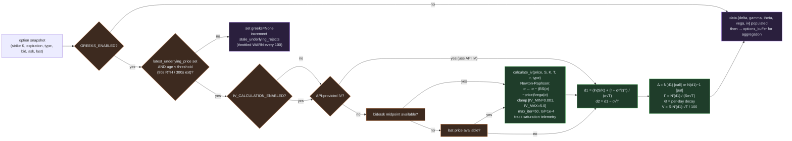
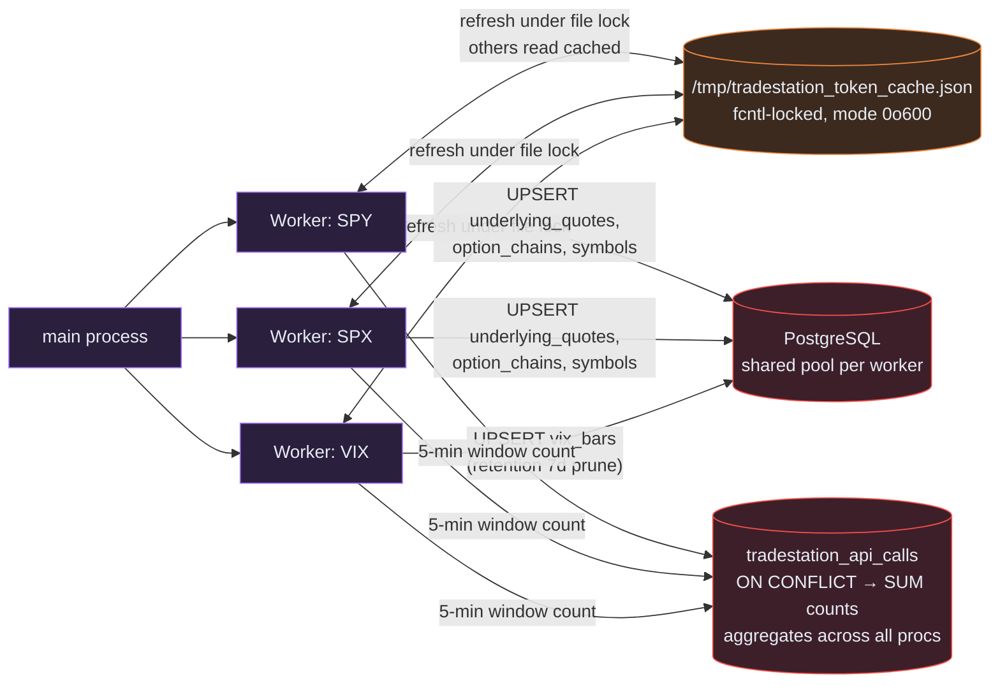

# Ingestion Engine — Architecture Diagram

This document diagrams how the Ingestion Engine works end-to-end. The engine
streams quotes/bars from TradeStation, computes Greeks and implied volatility,
classifies volume into bid/mid/ask buckets via the Lee-Ready prior-tick rule,
aggregates one-minute snapshots, and persists everything to PostgreSQL.

Sources mapped: `src/ingestion/main_engine.py`, `tradestation_auth.py`,
`tradestation_client.py`, `stream_manager.py`, `greeks_calculator.py`,
`iv_calculator.py`, `api_call_tracker.py`, `vix_ingester.py`, plus
`src/config.py`, `src/validation.py`, `src/market_calendar.py`, `src/symbols.py`.

---

## 1. Top-Level Architecture

```mermaid
flowchart TB
    classDef ext fill:#1a2733,stroke:#5b8def,color:#e6edf3
    classDef proc fill:#2a1f3d,stroke:#a371f7,color:#e6edf3
    classDef thread fill:#3d2a1f,stroke:#f0883e,color:#e6edf3
    classDef compute fill:#1f3d2a,stroke:#3fb950,color:#e6edf3
    classDef db fill:#3d1f2a,stroke:#f85149,color:#e6edf3
    classDef cfg fill:#2a2a2a,stroke:#8b949e,color:#e6edf3,stroke-dasharray:3 3

    %% ============ EXTERNAL ============
    subgraph EXT["External Systems"]
        direction TB
        OAUTH[("TradeStation OAuth2<br/>signin.tradestation.com<br/>POST /oauth/token<br/>grant_type=refresh_token")]:::ext
        REST[("TradeStation REST<br/>api.tradestation.com/v3<br/>/marketdata/quotes<br/>/marketdata/barcharts<br/>/marketdata/options/expirations<br/>/marketdata/options/strikes")]:::ext
        STREAM[("TradeStation Streaming<br/>/marketdata/stream/quotes/{syms}<br/>/marketdata/stream/barcharts/{sym}<br/>HTTP chunked, line-delimited JSON")]:::ext
    end

    %% ============ PROCESS TREE ============
    subgraph TOP["Process Tree (multiprocessing)"]
        direction TB
        MAIN["main()<br/><i>main_engine.py:1636-1748</i><br/>--underlyings SPY,SPX<br/>parse_underlyings()<br/>signal handlers (SIGINT/SIGTERM)"]:::proc

        subgraph WSPY["Worker: SPY"]
            direction TB
            RFS_SPY["run_for_symbol('SPY')<br/><i>:1687-1703</i>"]:::proc
            ENG_SPY["IngestionEngine.run()<br/><i>:1583-1633</i><br/>outer while loop"]:::proc
            STREAM_LOOP["run_streaming()<br/><i>:1506-1581</i><br/>per-iteration dispatch"]:::proc
            RFS_SPY --> ENG_SPY --> STREAM_LOOP
        end

        subgraph WSPX["Worker: SPX"]
            RFS_SPX["run_for_symbol('SPX')<br/>...mirror of SPY..."]:::proc
        end

        subgraph WVIX["Worker: VIX"]
            VIX["VIXIngester.run()<br/><i>vix_ingester.py:317-361</i><br/>5-min bars for $VIX.X"]:::proc
        end

        MAIN --> WSPY
        MAIN --> WSPX
        MAIN -- "INGEST_VIX_ENABLED" --> WVIX
    end

    %% ============ AUTH ============
    subgraph AUTH["Authentication Layer"]
        direction TB
        TA["TradeStationAuth<br/><i>tradestation_auth.py:24-333</i>"]:::compute
        TA_GET["get_access_token()<br/>:125-157<br/>check cache → refresh if &lt;30s TTL"]:::compute
        TA_REF["_refresh_access_token()<br/>:199-285<br/>fcntl file lock<br/>POST refresh_token grant"]:::compute
        TA_FORCE["force_refresh_access_token()<br/>:159-180<br/>called on 401"]:::compute
        TA_CACHE[("/tmp/tradestation_token_cache.json<br/>mode 0o600, fcntl-locked<br/>shared across all worker procs")]:::db
        TA --> TA_GET --> TA_REF
        TA_REF <--> TA_CACHE
        TA --> TA_FORCE --> TA_REF
    end

    %% ============ CLIENT ============
    subgraph CLIENT["TradeStationClient (tradestation_client.py:44-768)"]
        direction TB
        REQ["_request(method, endpoint, params)<br/>:139-275<br/>401→force_refresh+retry<br/>429→backoff+retry<br/>5xx→backoff+retry<br/>404→empty payload"]:::compute
        STR_SNAP["_request_stream_snapshot()<br/>:296-339<br/>one-shot stream read"]:::compute
        STR_OPEN["_get_or_open_stream()<br/>:345-388<br/>cached per stream_key"]:::compute
        STR_LINE["_next_stream_json_line()<br/>:390-409<br/>skip heartbeat/[DONE]"]:::compute
        APITRK["_record_api_https_session_open()<br/>:88-137<br/>5-min UTC window counter"]:::compute

        REQ --> APITRK
        STR_SNAP --> STR_OPEN --> STR_LINE
        STR_SNAP --> APITRK

        BARS["get_bars / get_stream_bars<br/>:474-591<br/>OHLCV + UpVolume/DownVolume"]:::compute
        OQUOTES["get_option_quotes<br/>:633-640<br/>batch contract quotes"]:::compute
        UQUOTES["get_stream_quotes<br/>:642-671<br/>streaming quote snapshot"]:::compute
        EXPS["get_option_expirations<br/>:597-615"]:::compute
        STRIKES["get_option_strikes<br/>:617-631"]:::compute
        BSYM["build_option_symbol()<br/>:692-716<br/>UND YYMMDD{C|P}STRIKE"]:::compute

        BARS --> STR_SNAP
        UQUOTES --> STR_SNAP
        OQUOTES --> REQ
        EXPS --> REQ
        STRIKES --> REQ
    end

    %% ============ STREAM MANAGER ============
    subgraph SMGR["StreamManager (stream_manager.py:750-1685)"]
        direction TB

        SMGR_INIT["initialize()<br/>:1120-1155<br/>fetch price, expirations, build symbols"]:::compute
        SMGR_BUILD["_build_option_symbols()<br/>:1044-1073<br/>N strikes × M expirations × 2 sides"]:::compute
        SMGR_META[/"_symbol_metadata dict<br/>{option_symbol: {strike, expiration, type}}"/]:::compute
        SMGR_STREAM["stream() main loop<br/>:1289-1685<br/>yields underlying / option_batch / flush_options"]:::compute
        SMGR_REFR["_should_refresh_expirations()<br/>:891-978<br/>date roll, 4PM ET close"]:::compute
        SMGR_RECAL["strike recalibration<br/>every STRIKE_RECALC_INTERVAL<br/>yields flush_options"]:::compute
        SMGR_HEALTH["underlying stream health<br/>:1418-1557<br/>stale-warn / stale-restart / max-attempts<br/>wall-clock based, session-aware"]:::compute
        SMGR_WAKE["_wakeup: threading.Event<br/>_stop_event: threading.Event"]:::compute

        SMGR_INIT --> SMGR_BUILD --> SMGR_META
        SMGR_STREAM --> SMGR_REFR
        SMGR_STREAM --> SMGR_RECAL
        SMGR_STREAM --> SMGR_HEALTH

        subgraph ACC_OPT["OptionStreamAccumulator (daemon thread)"]
            direction TB
            OA_SEED["_seed_from_rest()<br/>:283-298<br/>OPTION_BATCH_SIZE chunks"]:::thread
            OA_READ["_read_stream()<br/>:310-382<br/>persistent HTTP stream<br/>auto-reconnect 2s"]:::thread
            OA_MERGE["_merge_single_quote()<br/>:384-458<br/>Last/Bid/Ask/Mid: overwrite<br/>Volume/OI/IV: only if &gt;0"]:::thread
            OA_DRAIN["drain() :267-279<br/>return _dirty symbols only"]:::thread
            OA_SEED --> OA_MERGE
            OA_READ --> OA_MERGE
            OA_MERGE --> OA_DRAIN
        end

        subgraph ACC_UND["UnderlyingBarAccumulator (daemon thread)"]
            direction TB
            UA_READ["_read_stream()<br/>persistent 1-min bar stream<br/>barsback=1"]:::thread
            UA_MERGE["_merge_bar()<br/>:679-744<br/>carry-forward missing fields<br/>per-minute LRU bucket"]:::thread
            UA_DRAIN["drain() :542-548<br/>latest bar if _dirty"]:::thread
            UA_READ --> UA_MERGE --> UA_DRAIN
        end

        SMGR_STREAM <--> ACC_OPT
        SMGR_STREAM <--> ACC_UND
        ACC_OPT -- "sets" --> SMGR_WAKE
        ACC_UND -- "sets" --> SMGR_WAKE
    end

    %% ============ INGEST ENGINE ============
    subgraph ING["IngestionEngine (main_engine.py:1-1748)"]
        direction TB
        DISPATCH["dispatch loop<br/>for item in stream_manager.stream():<br/>switch item.type"]:::compute

        subgraph UPATH["Underlying Path"]
            direction TB
            STU["_store_underlying()<br/>:343-390<br/>bucket_timestamp(60s)<br/>parity signature"]:::compute
            UPS_UND["_upsert_underlying_quote()<br/>:392-450<br/>circuit breaker<br/>2^N+jitter backoff"]:::compute
            STU --> UPS_UND
        end

        subgraph OPATH["Options Path"]
            direction TB
            STOB["_store_option_batch()<br/>per-symbol minute buffer<br/>classify-on-arrival into accumulator"]:::compute
            ENRICH["_enrich_with_greeks()<br/>staleness gate:<br/>price age &lt; 90s RTH / 300s ext"]:::compute
            ACC[/"_FlowAccumulator (per option, per ET session)<br/>last_volume_cum, ask_cum, mid_cum, bid_cum<br/>last_bid/ask/mid (prior tick for next classify)"/]:::compute
            INGEST["_ingest_snapshot_into_accumulator()<br/>idempotent: watermark on last_volume_cum<br/>vol_delta = max(curr − watermark, 0)<br/>Lee-Ready classify using accumulator's prior NBBO"]:::compute
            HYDRATE["_hydrate_flow_accumulator()<br/>on first observation per (option, session):<br/>load latest persisted row for this ET session<br/>(volume, ask, mid, bid, NBBO)"]:::compute
            BUF[/"options_buffer[symbol]<br/>list of in-minute snapshots<br/>(quote/Greek fields only; flow lives in accumulator)"/]:::compute
            ROLLOVER["new minute bucket?<br/>emit prior bucket row<br/>keep last snapshot (no SEED_FLAG needed —<br/>accumulator watermark already counted it)"]:::compute
            AGG["_prepare_option_agg()<br/>read accumulator's session-cumulative totals<br/>pair with best-available quote/Greek fields"]:::compute
            CLASSIFY["_classify_volume_chunk()<br/>prior-tick rule<br/>FLOW_CLASSIFY_MID_BAND_PCT=0.70<br/>09:30 open auction → mid"]:::compute
            COAL["_coalesce_option_rows()<br/>dedup (sym,ts) via MAX on every<br/>monotonic cumulative field"]:::compute
            WRITE["_write_option_rows()<br/>idempotent UPSERT (GREATEST on every monotonic col)<br/>unified retain-and-retry on any failure<br/>circuit breaker, retained-failed-rows queue (≤20k)"]:::compute

            STOB --> ENRICH
            ENRICH --> INGEST
            INGEST --> ACC
            HYDRATE --> ACC
            INGEST --> CLASSIFY
            ENRICH --> BUF --> ROLLOVER --> AGG
            AGG -.read.-> ACC
            AGG --> COAL --> WRITE
        end

        FLUSH["_flush_all_buffers()<br/>:1468-1496<br/>on shutdown / expiration refresh / strike recalc / BUFFER_FLUSH_INTERVAL"]:::compute
        DISPATCH -- "underlying" --> UPATH
        DISPATCH -- "option_batch / option" --> OPATH
        DISPATCH -- "flush_options" --> FLUSH
        FLUSH --> AGG
    end

    %% ============ GREEKS / IV ============
    subgraph QUANT["Greeks &amp; IV (greeks_calculator.py / iv_calculator.py)"]
        direction TB
        GC["GreeksCalculator.enrich_option_data()<br/>:289-360"]:::compute
        IVC["IVCalculator.enrich_option_data_with_iv()<br/>:361-436<br/>prefer bid/ask mid → last"]:::compute
        IVNR["calculate_iv() :191-319<br/>Newton-Raphson<br/>max_iter=50, tol=1e-4<br/>clamp [0.001, 5.0]<br/>telemetry: saturation fraction"]:::compute
        BS["calculate_all_greeks() :214-287<br/>Black-Scholes Δ Γ Θ V<br/>q=0 dividend-free"]:::compute
        T2E["calculate_time_to_expiration()<br/><i>market_calendar.py</i><br/>years to expiry"]:::compute

        GC --> IVC --> IVNR
        IVNR --> T2E
        GC --> BS --> T2E
    end

    %% ============ API CALL TRACKER ============
    subgraph TRK["API Call Tracker (api_call_tracker.py)"]
        WIN["write_api_call_window()<br/>:23-48<br/>upsert per 5-min UTC window<br/>SUM counts across procs"]:::compute
    end

    %% ============ MARKET CALENDAR / VALIDATION ============
    subgraph SUP["Support Modules"]
        direction TB
        MC["market_calendar.py<br/>is_engine_run_window()<br/>get_market_session()<br/>underlying_feed_expected()<br/>calculate_time_to_expiration()"]:::cfg
        VAL["validation.py<br/>safe_float/int/datetime<br/>bucket_timestamp(60s)<br/>validate_bar_data()"]:::cfg
        SYM["symbols.py<br/>parse_underlyings()<br/>resolve_option_root()<br/>get_canonical_symbol()<br/>(SPX → SPXW weekly root)"]:::cfg
        CFG["config.py<br/>AGGREGATION_BUCKET_SECONDS=60<br/>MARKET_HOURS_POLL_INTERVAL=2s<br/>EXTENDED_HOURS_POLL_INTERVAL=30s<br/>CLOSED_HOURS_POLL_INTERVAL=300s<br/>MAX_BUFFER_SIZE=10000<br/>BUFFER_FLUSH_INTERVAL=60s<br/>OPTION_BUCKET_WRITE_MIN_SECONDS=5<br/>GREEKS_ENABLED, RISK_FREE_RATE=0.05<br/>IV_CALCULATION_ENABLED<br/>FLOW_CLASSIFY_MID_BAND_PCT=0.70<br/>FLOW_CLASSIFY_SKIP_OPEN_AUCTION=true<br/>UNDERLYING_STREAM_STALE_WARN/RESTART<br/>API_RETRY_ATTEMPTS=3, API_RETRY_DELAY=1s, API_RETRY_BACKOFF=2.0<br/>INGEST_VIX_ENABLED, VIX_INITIAL_BARSBACK=160"]:::cfg
    end

    %% ============ DATABASE ============
    subgraph DB["PostgreSQL"]
        direction TB
        TBL_SYM[("symbols<br/>upsert once at start")]:::db
        TBL_UQ[("underlying_quotes<br/>PK (symbol, timestamp)<br/>open=COALESCE existing<br/>high=GREATEST, low=LEAST<br/>close=new")]:::db
        TBL_OC[("option_chains<br/>PK (option_symbol, timestamp)<br/>Quote: COALESCE(new, existing)<br/>Volume/OI: GREATEST<br/>Flow vols: ADDITIVE<br/>Greeks/IV: new wins")]:::db
        TBL_API[("tradestation_api_calls<br/>PK (window_start)<br/>count summed across procs")]:::db
        TBL_VIX[("vix_bars<br/>PK (timestamp)<br/>retention 7 days")]:::db
    end

    %% ============ WIRING ============
    TA_REF -.->|"POST"| OAUTH
    REQ -->|"Authorization: Bearer"| TA
    REQ -.->|"GET"| REST
    STR_OPEN -.->|"GET stream=True"| STREAM
    OA_READ -.->|"persistent stream"| STREAM
    UA_READ -.->|"persistent stream"| STREAM

    SMGR_INIT --> BARS
    SMGR_INIT --> EXPS
    SMGR_INIT --> STRIKES
    SMGR_INIT --> BSYM
    OA_SEED --> OQUOTES
    OA_READ --> STR_OPEN
    UA_READ --> STR_OPEN

    STREAM_LOOP --> SMGR_STREAM
    STREAM_LOOP --> DISPATCH

    ENRICH --> GC
    ENRICH -.->|"check last_underlying_price age"| UPATH

    APITRK --> WIN
    WIN -.write.-> TBL_API

    UPS_UND -.UPSERT.-> TBL_UQ
    WRITE -.UPSERT.-> TBL_OC
    BASE -.SELECT.-> TBL_OC

    VIX -.UPSERT.-> TBL_VIX
    VIX --> BARS

    ENG_SPY -.check.-> MC
    SMGR_HEALTH -.check.-> MC
    DISPATCH -.use.-> VAL
    MAIN -.use.-> SYM
    ING -.read.-> CFG

    %% Run window gating
    MC -. is_engine_run_window .-> ENG_SPY
```



---

## 2. Cold-Start Sequence (one symbol)

```mermaid
sequenceDiagram
    autonumber
    participant U as main()
    participant W as Worker(run_for_symbol)
    participant E as IngestionEngine
    participant SM as StreamManager
    participant A as TradeStationAuth
    participant C as TradeStationClient
    participant TS as TradeStation API
    participant DB as PostgreSQL

    U->>W: spawn Process(target=run_for_symbol, args=('SPY',))
    W->>C: TradeStationClient(client_id, secret, refresh_token)
    C->>A: TradeStationAuth.__init__
    W->>E: IngestionEngine('SPY', exps=3, strikes=10)
    E->>DB: INSERT symbols ON CONFLICT
    W->>E: engine.run()

    loop outer run loop
        E->>E: is_engine_run_window()?
        alt outside window
            E->>E: sleep until window opens
        else inside window
            E->>SM: StreamManager(...).initialize()
            SM->>C: get_stream_bars(barsback=1)
            C->>A: get_access_token() [refresh if &lt;30s TTL]
            A->>TS: POST /oauth/token (fcntl-locked, shared cache)
            TS-->>A: access_token + expires_in
            C->>TS: GET /marketdata/stream/barcharts/SPY (snapshot)
            TS-->>C: 1 bar (close, up_vol, down_vol)
            SM->>C: get_option_expirations('SPY')
            C->>TS: GET /marketdata/options/expirations/SPY
            TS-->>C: [exp1, exp2, exp3, ...]
            SM->>C: get_option_strikes('SPY', exp) [×N]
            TS-->>C: list of strikes near ATM
            SM->>SM: _build_option_symbols() — N×M×2 contracts
            SM->>C: validate one quote (smoke test)

            par background reader: OptionStreamAccumulator
                SM->>C: _seed_from_rest (OPTION_BATCH_SIZE chunks)
                C->>TS: GET /marketdata/quotes/{batch}
                TS-->>C: snapshot quotes
                SM->>TS: GET /marketdata/stream/quotes/{all_syms} [persistent]
                loop on every line
                    TS-->>SM: JSON quote
                    SM->>SM: _merge_single_quote (selective overwrite)
                    SM->>SM: _dirty.add(sym); _wakeup.set()
                end
            and background reader: UnderlyingBarAccumulator
                SM->>TS: GET /marketdata/stream/barcharts/SPY [persistent]
                loop on every line
                    TS-->>SM: JSON bar
                    SM->>SM: _merge_bar (LRU per-minute bucket)
                    SM->>SM: _dirty=True; _wakeup.set()
                end
            end

            loop main dispatch (stream() yields items)
                SM->>E: yield {type: 'underlying', data: bar}
                E->>E: _store_underlying → bucket_timestamp
                E->>DB: UPSERT underlying_quotes

                SM->>E: yield {type: 'option_batch', data: [contracts]}
                loop per contract
                    E->>E: _enrich_with_greeks (if price age OK)
                    E->>E: append to options_buffer[sym]
                    alt new minute bucket
                        E->>E: _prepare_option_agg(prev) → row
                        E->>E: seed next bucket (_SEED_FLAG)
                    end
                    alt should_write_option_bucket (≥5s since last)
                        E->>E: _prepare_option_agg(curr, keep_last=True) → row
                    end
                end
                E->>E: _coalesce_option_rows
                E->>DB: UPSERT option_chains (additive on flow)

                SM->>E: yield {type: 'flush_options'} (on expir refresh / strike recalc)
                E->>E: _flush_all_buffers()
            end
        end
    end
```

---

## 3. Lee-Ready Classification & Cumulative Flow Accumulation

Classification happens at snapshot arrival (`_ingest_snapshot_into_accumulator`),
not in the per-bucket aggregation step. The per-contract `_FlowAccumulator` holds
running session-cumulative totals; the aggregation step just reads them.

```mermaid
flowchart TB
    classDef step fill:#1f3d2a,stroke:#3fb950,color:#e6edf3
    classDef branch fill:#2a1f3d,stroke:#a371f7,color:#e6edf3
    classDef io fill:#3d1f2a,stroke:#f85149,color:#e6edf3

    A["incoming snapshot for option_symbol<br/>{last, bid, ask, mid, volume_cum, oi, iv, ts}"]:::step
    B["bucket = bucket_timestamp(ts, 60s)"]:::step
    C["acc = _get_flow_accumulator(option_symbol, bucket)"]:::step
    C2{"acc exists?<br/>acc.session_date matches bucket?"}:::branch
    HYD["_hydrate_flow_accumulator()<br/>SELECT volume, ask_volume, mid_volume,<br/>bid_volume, bid, ask, mid<br/>FROM option_chains<br/>WHERE option_symbol=? AND timestamp >= session_start<br/>ORDER BY timestamp DESC LIMIT 1<br/><br/>or zeros if no row this session"]:::io
    D["vol_delta = max(volume_cum − acc.last_volume_cum, 0)"]:::step
    D2{"vol_delta &gt; 0?"}:::branch
    E["acc unchanged; refresh prior tick fields"]:::step
    G{"is_opening_auction_bucket (09:30 ET)<br/>+ FLOW_CLASSIFY_SKIP_OPEN_AUCTION?"}:::branch
    H["acc.mid_cum += vol_delta<br/>(auction price not comparable to NBBO)"]:::step
    I["_classify_volume_chunk(vol_delta, last,<br/>acc.last_bid, acc.last_ask, acc.last_mid)"]:::step

    subgraph CL["Lee-Ready prior-tick rule"]
        direction TB
        I1{"prior bid/ask in accumulator?"}:::branch
        I2["fall through to snapshot's own bid/ask<br/>(cold-start: first snapshot of session)"]:::step
        I3["half_spread = (ask−bid)/2"]:::step
        I4["band = half_spread × FLOW_CLASSIFY_MID_BAND_PCT (0.70)"]:::step
        I5{"last vs mid ± band"}:::branch
        I6["above mid+band → ask_volume"]:::step
        I7["below mid−band → bid_volume"]:::step
        I8["within band → mid_volume"]:::step
        I1 -- no --> I2
        I1 -- yes --> I3 --> I4 --> I5
        I5 -- &gt; --> I6
        I5 -- &lt; --> I7
        I5 -- = --> I8
    end

    I --> CL
    CL --> J["acc.ask_cum/mid_cum/bid_cum += classified delta"]:::step
    J --> K["acc.last_volume_cum = max(curr_vol, watermark)<br/>acc.last_bid/last_ask/last_mid = snapshot's NBBO"]:::step
    E --> K
    H --> K

    K --> L["snapshot appended to options_buffer[symbol]<br/>(for quote/Greek aggregation only)"]:::step

    L --> M{"bucket rollover?"}:::branch
    M -- "yes" --> N["emit prior bucket row via _prepare_option_agg()<br/>keep_last_snapshot=False"]:::step
    M -- "no" --> O{"_should_write_option_bucket throttle?"}:::branch
    O -- "yes" --> P["emit current bucket row via _prepare_option_agg()<br/>keep_last_snapshot=True"]:::step
    O -- "no" --> Z["wait for next snapshot"]:::step

    PREP["_prepare_option_agg() reads accumulator:<br/>row.volume = acc.last_volume_cum<br/>row.ask_volume = acc.ask_cum<br/>row.mid_volume = acc.mid_cum<br/>row.bid_volume = acc.bid_cum<br/>row.last/bid/ask/mid/IV/Greeks = best from buffer"]:::step
    N --> PREP
    P --> PREP

    PREP --> Q["row → _write_option_rows()"]:::step
    Q --> R["_coalesce_option_rows()<br/>dedup by (option_symbol, timestamp)<br/>quote = latest non-null<br/>volume/OI/ask/mid/bid_volume = MAX"]:::step
    R --> S[("UPSERT option_chains<br/>ON CONFLICT (option_symbol, timestamp):<br/>quote=COALESCE; greeks/iv = new;<br/>volume/OI/ask/mid/bid_volume = GREATEST<br/>(idempotent under retry)")]:::io

    A --> B --> C --> C2
    C2 -- "no" --> HYD --> D
    C2 -- "yes" --> D
    D --> D2
    D2 -- "no" --> E
    D2 -- "yes" --> G
    G -- "yes" --> H
    G -- "no" --> I
```



**Key invariants in the new design:**

| Invariant | Why it matters |
|---|---|
| `acc.last_volume_cum` is a watermark; `vol_delta = max(curr − watermark, 0)` | Replay-safe: the same snapshot ingested twice contributes zero new flow the second time |
| Classification uses accumulator's prior NBBO when it is *recent*, else the snapshot's own | Lee-Ready prior-tick rule preserved across snapshots within a session — but a prior tick older than `FLOW_CLASSIFY_PRIOR_TICK_MAX_AGE_SECONDS` (a quiet contract that then moves) is rejected for the contemporaneous quote, so a stale quote can't invert the side by degrading the quote-test into a tick-test (`_select_classify_quote`) |
| Accumulator is keyed by `(option_symbol, ET session date)` | TradeStation's 09:30 ET volume reset is honored automatically (different session date → fresh hydrate) |
| `option_chains.{ask,mid,bid}_volume` are session-cumulative monotonic | Matches what `flow_contract_facts` already expected (via `LAG()` deltas) — fixes a latent inconsistency in the prior additive-upsert design |
| UPSERT uses `GREATEST` on every monotonic column with `IS DISTINCT FROM` WHERE guard | Retries are idempotent: re-submitting a row that already committed is a no-op |
| Per-row invariant: `ask_volume + mid_volume + bid_volume == volume` (modulo opening auction) | The classified columns reconcile against the raw volume column |

---

## 4. Greeks / IV Enrichment



---

## 5. Error Handling, Circuit Breakers & Resilience

```mermaid
flowchart TB
    classDef ok fill:#1f3d2a,stroke:#3fb950,color:#e6edf3
    classDef warn fill:#3d2a1f,stroke:#f0883e,color:#e6edf3
    classDef err fill:#3d1f2a,stroke:#f85149,color:#e6edf3

    subgraph HTTP["HTTP Retry Matrix (_request)"]
        H401["401 Unauthorized"] --> H401A["force_refresh(failed_token) → retry (≤API_RETRY_ATTEMPTS)"]:::warn
        H429["429 Rate Limited"] --> H429A["sleep API_RETRY_DELAY × API_RETRY_BACKOFF^N → retry"]:::warn
        H5XX["5xx Server"] --> H5XXA["exponential backoff → retry"]:::warn
        H404["404 Not Found"] --> H404A["return empty {Quotes:[], Bars:[], ...}"]:::ok
        H403["403 quota"] --> H403A["log + raise (no retry)"]:::err
        HTO["request timeout"] --> HTOA["backoff → retry"]:::warn
    end

    subgraph DBCB["DB Circuit Breaker (underlying & options)"]
        DB1["consecutive_failures += 1"]:::warn
        DB2["backoff = min(60, 2^N) + 0..10% jitter"]:::warn
        DB3["set _db_backoff_until = now+backoff"]:::warn
        DB4["pre-commit OR commit-phase fail → retain rows (≤20k)<br/>(unified path: GREATEST-based upsert makes retry idempotent;<br/>no fork between rolled-back vs ambiguous-commit)"]:::warn
        DB6["success → reset counters; log recovery"]:::ok
        DB1 --> DB2 --> DB3
        DB3 --> DB4
        DB3 --> DB6
    end

    subgraph STREAM_H["Underlying Stream Watchdog"]
        SH1["wall-clock since last advancing bar"]:::ok
        SH2["age &gt; STALE_WARN (60s RTH / 300s ext)<br/>→ WARN"]:::warn
        SH3["age &gt; STALE_RESTART (120s / 600s)<br/>→ forced reconnect (cooldown 10s, max 5)"]:::warn
        SH4["max attempts exceeded → backed-off upstream-outage<br/>(reset on bar arrival)"]:::err
        SH5["timestamp must advance, not just replay<br/>(barsback=1 replay does NOT reset clock)"]:::ok
        SH1 --> SH2 --> SH3 --> SH4
        SH1 --> SH5
    end

    subgraph IV_TM["IV Solver Telemetry"]
        IV1["track fraction of solves saturating bounds"]:::ok
        IV2["every IV_CLAMP_REPORT_INTERVAL_SECONDS (300s):<br/>frac &gt;= 0.5 → WARN (IV range miscalibrated)<br/>else INFO; reset counters"]:::warn
        IV1 --> IV2
    end

    subgraph SHUTDOWN["Graceful Shutdown"]
        SD1["SIGINT/SIGTERM"]:::warn
        SD2["StreamManager.request_stop()<br/>sets _stop_event AND _wakeup<br/>(_wakeup critical to break idle wait)"]:::ok
        SD3["stream loop finally block:<br/>stop accumulators<br/>_flush_all_buffers()<br/>close_all_streams()<br/>close DB pool"]:::ok
        SD1 --> SD2 --> SD3
    end
```



---

## 6. Multi-Process Coordination



---

## 7. Key Configuration (compact)

| Knob | Default | Effect |
|---|---|---|
| `AGGREGATION_BUCKET_SECONDS` | 60 | One-minute aggregation bucket |
| `MARKET_HOURS_POLL_INTERVAL` / `_EXTENDED_` / `_CLOSED_` | 2 / 30 / 300 s | Idle wait between drains by session |
| `MAX_BUFFER_SIZE` | 10 000 | Safety-valve flush per symbol |
| `BUFFER_FLUSH_INTERVAL` | 60 s | Time-based safety flush |
| `OPTION_BUCKET_WRITE_MIN_SECONDS` | 5 | Throttle in-minute writes |
| `INGEST_EXPIRATIONS` / `INGEST_STRIKE_PCT_RANGE` / `INGEST_STRIKE_COUNT_MAX` | 3 / 3.0% / 40 | Per-underlying universe: N expirations × strikes within ±pct of spot, capped at MAX per exp (trim furthest-first) |
| `GREEKS_ENABLED` | false | Enable Black-Scholes enrichment |
| `RISK_FREE_RATE` | 0.05 | BS rate |
| `IV_CALCULATION_ENABLED` | false | Solve IV from prices |
| `IV_MIN` / `IV_MAX` / `IV_MAX_ITERATIONS` / `IV_TOLERANCE` | 0.001 / 5.0 / 50 / 1e-4 | Newton-Raphson bounds |
| `FLOW_CLASSIFY_MID_BAND_PCT` | 0.70 | Lee-Ready mid-band width |
| `FLOW_CLASSIFY_SKIP_OPEN_AUCTION` | true | Route 09:30 ET volume to mid |
| `UNDERLYING_STREAM_STALE_WARN/RESTART_SECONDS` (+ `_EXTENDED`) | 60/120 (300/600) | Watchdog thresholds |
| `UNDERLYING_STREAM_RESTART_COOLDOWN` / `_MAX_ATTEMPTS` | 10 s / 5 | Restart rate limit |
| `API_RETRY_ATTEMPTS` / `_DELAY` / `_BACKOFF` | 3 / 1 s / 2.0 | HTTP retry policy |
| `STREAM_REUSE_CONNECTIONS` / `_QUOTES` | — | Keep stream open between snapshots |
| `INGEST_VIX_ENABLED` | true | Spawn VIX child process |
| `VIX_INITIAL_BARSBACK` / `VIX_POLL_BARSBACK` | 160 / 3 | VIX seed vs reconnect depth |
| `VIX_BARS_RETENTION_DAYS` | 7 | VIX prune horizon |
