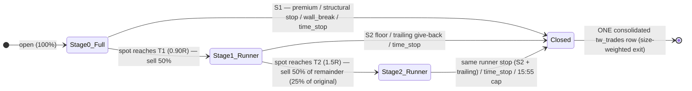

# TradeWorkz Exit Strategy — Architecture & Design

**Status:** **Implemented.** The tightened premium stop (§6.1) and the full
scale-out ladder (§4–§8) are live — schema, config, `open_position` arming,
`BaseBot._scale_exit_decision`, `partial_close_position`, the consolidated
`close_position`, engine wiring, and tests (`tests/test_tradeworkz_scale_out.py`).
§9 records the build order; §11–§12 the quant rationale and worked scenarios.

**Scope:** How the TradeWorkz bot fleet decides *when and how much* to exit an
open position — targets, stop-losses, time-stops — and the design for a
three-tier scale-out / trailing-runner exit that replaces today's
all-or-nothing exit for trades that go into profit.

**Audience:** Anyone touching `src/tradeworkz/bots/base.py`,
`src/tradeworkz/reconciler.py`, `src/tradeworkz/engine.py`,
`src/tradeworkz/simulate.py`, or the `tw_positions` / `tw_trades` schema.

---

## Table of contents

1. [How exits work today (as-is)](#1-how-exits-work-today-as-is)
2. [Bookkeeping & accounting invariants (as-is)](#2-bookkeeping--accounting-invariants-as-is)
3. [Why change it](#3-why-change-it)
4. [The scale-out ladder (to-be)](#4-the-scale-out-ladder-to-be)
5. [Locked design decisions & rationale](#5-locked-design-decisions--rationale)
6. [Stop-loss model](#6-stop-loss-model)
7. [Consolidated bookkeeping (to-be)](#7-consolidated-bookkeeping-to-be)
8. [Data-model & config changes](#8-data-model--config-changes)
9. [Implementation plan](#9-implementation-plan)
10. [Risks & open questions](#10-risks--open-questions)
11. [Quant / game-theory rationale](#11-quant--game-theory-rationale)
12. [Worked scenarios](#12-worked-scenarios)

---

## 1. How exits work today (as-is)

### 1.1 Targets are underlying-spot price *levels*, derived per strategy

Every bot sets `target_price` and `stop_price` on its `TradeSignal` at entry
(`src/tradeworkz/models.py:26-50`). These are **absolute price levels of the
underlying spot** — *not* percentages, *not* option-premium levels. The value
is a concrete price, but each bot *derives* that price from a structural
reference specific to its thesis, so "specific price / specific % / specific
level / conditional on strategy" are all partly true at once: it is a **spot
price, computed from a structural level, and which level is used is conditional
on the strategy.**

| Bot | Target derived from | Stop derived from |
| --- | --- | --- |
| `bull_momentum_climber` | `snap.call_wall` (`bots/bull_momentum_climber.py:105`) | `snap.gamma_flip` (`:106`) |
| `max_pain_gravitator` | `snap.max_pain` (`bots/max_pain_gravitator.py:55`) | derived level |
| `vwap_reversion_scalper` | `snap.vwap` (`bots/vwap_reversion_scalper.py:56`) | derived level |
| `gamma_flip_breaker` / `defender` | gamma-flip level | gamma-flip level |
| `opening_range_hunter` | opening-range extension | opening-range edge |
| `put_wall_magnet_reversal` | wall level | `None` — relies on wall-break + premium stop (`:181`) |
| `put_call_wall_bouncer` | wall level | `None` — same |

### 1.2 The exit is evaluated every tick, and it is all-or-nothing

The engine loop marks each open position, then asks the bot for an exit
decision, and closes the **entire** position if told to
(`src/tradeworkz/engine.py:215-225`):

```python
for pos in load_open_positions(conn, bot_id):
    if pos.underlying != u:
        continue
    mark = mark_position(conn, pos)
    if mark is None:
        continue
    decision = bot.exit_criteria(snap, pos)
    if decision.should_close:
        close_position(conn, pos, reason=decision.reason or "signal")
```

`BaseBot.exit_criteria` (`src/tradeworkz/bots/base.py:152-231`) evaluates, in
order:

1. **Premium damage-control stop** (`:196-205`) — fires *regardless* of the
   min-hold window. If `1 - current_price/entry_price >= max_premium_loss_pct`,
   close with `reason="premium_stop"`. See §6.1.
2. **Structural target** (`:208-212`) — compared against `snap.spot`:
   bullish exits when `spot >= target_price`, bearish when `spot <= target_price`.
3. **Structural stop** (`:213-217`) — bullish exits when `spot <= stop_price`,
   bearish when `spot >= stop_price`.
4. **Time-stop** (`:221-222`) — close when `now >= time_stop_at`.
5. **Wall-break / wall-shift** (`:228-230`, `_wall_stop_signal` `:292-342`) —
   for wall-fade bots that set `wall_ref_side`.

Two timing gates shape this:

- **`min_hold_until`** (`:180-181`) — price-level exits (target/structural stop)
  are suppressed until `MIN_HOLD_SECONDS` (default **90 s**,
  `config.py:57`) elapse, so a wick can't unwind the thesis instantly. The
  premium stop and time-stop are *not* gated.
- **`time_stop_at`** — set by each bot from `max_hold_minutes` (30–180 min
  depending on bot), then **hard-capped at 15:55 ET** on the earliest leg's
  expiration by the reconciler (`_EXPIRATION_CLOSE_HHMM`,
  `reconciler.py:35`, `_cap_time_stop_at_expiration:71-96`). A 0DTE can never
  ride past 15:55 ET.

### 1.3 The partial-exit scaffolding exists but is unwired

`ExitDecision` (`models.py:53-62`) already carries `should_cut`, `cut_fraction`,
`should_add`, `add_fraction` — but **nothing in `engine.py` or `reconciler.py`
reads them** (verified). The default `exit_criteria` only ever returns
`should_close`. These dormant fields are the natural attachment point for the
scale-out ladder (§9).

---

## 2. Bookkeeping & accounting invariants (as-is)

A position lives in `tw_positions` (fast per-tick lookup); on close the row is
**deleted** and one immutable row is written to the `tw_trades` blotter, in the
same transaction (`reconciler.close_position:353-470`,
`schema.sql:2474-2523`).

`close_position` does five things atomically:

1. **Insert one `tw_trades` row** (`:378-409`): `quantity`, `entry_price`,
   `exit_price`, `realized_pnl`, `pnl_percent`, `outcome`, `close_reason`,
   `components_at_exit`.
2. **Delete the `tw_positions` row** (`:413`).
3. **Credit `tw_bot_capital`** by `realized` (`:414-423`).
4. **Update ML state** — one `online_update` sample with `won=(outcome=="win")`
   plus a defensive `recalibrate_bot` (`:425-450`).
5. **Fan out an `exit` event** to `tw_notifications_log`, the delivery **audit
   trail** (`:452-469`, `schema.sql:2592-2604`).

P&L for these long-debit structures is
`realized = (exit_price − entry_price) × quantity × 100` (`:365-366`).

These are guarded by `setup/database/diagnostics/tradeworkz_invariants.sql`
(run via `make tradeworkz-check`). The ones that constrain any new exit logic:

- **Invariant A** (`:33-43`): for every live closed trade,
  `realized_pnl == (exit_price − entry_price) × quantity × 100`. The recorded
  `exit_price` must be arithmetically consistent with `realized_pnl` and
  `quantity`. **This is the binding constraint on a consolidated multi-tranche
  close — see §7.**
- **Invariant B** (`:57-73`): per bot,
  `current_capital − starting_capital == Σ realized_pnl` over live trades. Every
  dollar credited to capital must be backed by exactly one trade row.
- **Invariant C** (`:84-93`): `outcome` sign matches `realized_pnl`.

---

## 3. Why change it

Today a winner is capped and exited whole the instant spot touches its single
structural target — there is **no runner**. On the downside, an un-stopped
winner can round-trip all the way back to the premium stop and give everything
back. The base class flags exactly this failure mode in its own docstring. For a
0DTE ATM debit, a move that goes +60% and reverses can hand the entire gain
back before any structural stop is reached.

Booking part of the position at the first target and trailing the rest is the
standard fix. It reduces variance (a real win is locked in early) and lets the
occasional strong trend pay for the many scratches — which the current
single-target exit structurally cannot capture.

---

## 4. The scale-out ladder (to-be)

Applies **only to positions in profit**. The existing stop-loss stack (§6)
remains in force throughout — the ladder governs how *profits* are harvested; it
does not loosen downside control.

### Level geometry

Define **R = effective_target − entry_spot**, where `effective_target` is the
bot's published `target_price` (call wall, max pain, VWAP, …) **capped to a
reachable envelope** `entry_spot × (1 ± LADDER_MAX_MOVE_PCT)` (default 0.8%, §5f).
Every ladder level is a fixed fraction of R, **frozen at entry** (a later config
change never moves an open position's levels). Bullish shown; bearish mirrors
with the sign flipped.

| Symbol | Level | Default | Role |
| --- | --- | --- | --- |
| **S1** | original stop stack | — | whole-trade stop (structural stop + 25% premium + wall-break), Stage 0 |
| **S2** | `entry + 0.75·R` | 0.75 | runner floor stop, armed once T1 fills |
| **T1** | `entry + 0.90·R` | 0.90 | take **50%** — fires *before* the structural level |
| **T2** | `entry + 1.5·R` | 1.5 | take **50% of the remainder** (25% of original) — half an R past the target |

Worked geometry — bullish, `entry_spot = 749`, `bull_momentum_climber` call wall
`= 750`, so **R = 1.00**:

```
entry 749.00 (0R) ── S2 749.75 (0.75R) ── T1 749.90 (0.90R) ── [wall 750.00, 1R] ── T2 750.50 (1.5R)
                       └ runner floor        └ take 50%            (reference only)      └ take 25%
```



**Stage 0 — full position (pre-T1).** Governed exactly as today: target = **T1
(0.90·R)**, plus the S1 stack — structural stop, premium stop, wall-break,
time-stop. If any fires here, the whole position closes as it does now.

**T1 hit (spot reaches 0.90·R): take 50%.** Sell `floor(0.5 × Q)` contracts.
Enter Stage 1. The taken profit is *booked* (§7) but no trade row is written yet.

**Stage 1 — runner (the remaining ~50%).**
- **Target = T2** (1.5·R), half an R past the structural target (§5b).
- **Stop = S2 (0.75·R) floor, ratcheting tighter** via the premium give-back
  from the runner's high-water mark (§5c–d). Effective stop = the *higher* of S2
  and the trailing level, so it can only tighten as spot extends — never looser
  than S2. Because S2 sits above entry, even a stopped-out runner books a small
  gain.
- The premium hard-floor and time-stop remain as backstops.

**T2 hit (spot reaches 1.5·R): take 50% of the remainder (25% of original).**
Enter Stage 2.

**Stage 2 — final runner (the last ~25%).**
- **Keeps the same runner stop** (S2 floor + trailing give-back) that governed
  Stage 1 — it simply rides until the time-stop / 15:55 ET cap or that runner
  stop is hit.

**Terminal.** When the last tranche exits by any reason, write **one**
consolidated `tw_trades` row (§7).

### Worked example (why the record stays honest)

Entry premium `1.00`, `Q = 4` contracts. T1 fills 2 @ `1.60`; T2 fills 1 @
`2.00`; the final runner stops out on the trailing give-back, filling 1 @ `1.40`.

- Size-weighted exit = `(2×1.60 + 1×2.00 + 1×1.40) / 4 = 6.60 / 4 = 1.65`
- Consolidated `realized_pnl = (1.65 − 1.00) × 4 × 100 = $260`
- Tranche sum = `120 + 100 + 40 = $260` ✓ — identical, so **Invariant A holds**.

One `tw_trades` row: `quantity=4`, `exit_price=1.65`, `realized_pnl=260`,
`pnl_percent=0.65`, with the three tranches enumerated in `components_at_exit`.

---

## 5. Locked design decisions & rationale

**(a) T1 fires *before* the structural level — `entry + 0.90·R`.** The first
(largest) tranche takes profit at 90% of the way to the bot's structural target,
not at it. Walls / max-pain / VWAP act as **magnets and resistance**: price
routinely stalls or reverses in the last tick before touching them, so an exit
pinned exactly at the level fills far less often. Taking 0.90·R protects the
majority of the position with a materially higher fill rate — "leave the last
eighth for the next guy." Fraction is per-bot configurable (`t1_trigger_frac`,
default 0.90). Requires storing **`entry_spot`**, which the position does not
persist today (only `entry_price`, the option premium).

**(b) T2 — a direct fraction of R, `entry + 1.5·R`.** The second take (25% of
original) sits **half an R past the structural target**. Expressed as a direct
fraction of R for consistency with T1 (0.90) and S2 (0.75), rather than as an
extension multiplier off T1 — one uniform mental model, no anchor ambiguity.
Chosen over "next structural level" because **not every bot has a clean second
level** (many target max-pain / VWAP with nothing obvious beyond); a fixed
R-multiple is universal and backtestable with one knob. 1.5 (vs an earlier 1.8)
keeps T2 reachable intraday on 0DTE — a full extra R past the target is a big ask
for a same-day move; half an R is a realistic stretch that still meaningfully
rewards the runner. Per-bot configurable (`t2_target_frac`, default 1.5).

**(c) S2 — the runner floor at `entry + 0.75·R`, with wiggle room.** Once T1
fills, the remaining ~50% gets a hard floor stop **below** T1 (0.75·R vs T1's
0.90·R). Deliberately *looser* than a stop parked at T1 or at the structural
level, both of which get wicked out by ordinary noise right after the target is
tagged. S2 sits above entry, so a stopped runner still books a small gain
(+0.75·R of spot). Per-bot configurable (`s2_stop_frac`, default 0.75). Named
S2 to distinguish it from **S1**, the original whole-trade stop that still
governs Stage 0.

**(d) Trailing give-back ratchets on top of S2 — premium, not spot.** The runner
also carries a premium give-back trail: it exits if the option mark falls
`≥ runner_trail_giveback_pct` (default 30%) from its **high-water mark**. The
effective runner stop is the *tighter* of S2 and the trailing level, so S2 is
the initial floor and the trail takes over as spot extends past T2. Premium-based
rather than spot-based because on 0DTE **theta** erodes the mark even when spot
holds — a spot trail misses that decay; a premium give-back captures it.

**(e) Ride-to-EOD, uniform across tiers, final 25% keeps the runner stop.** Not
tier-dependent. After T2, the last ~25% carries the *same* protection as
Stage 1 (S2 floor + trailing give-back) and rides to the 15:55 ET cap. Because
the trailing give-back is always active, a big T2 winner can't quietly bleed to
theta — it trails out once it surrenders 30% of its peak. This resolves the
earlier §10 concern (a final tranche stopped only at a distant fixed level)
without pinning a hard stop that noise would trip.

**(f) Target-distance cap — keep the whole ladder reachable.** The ladder is
only as useful as the target it anchors to. Some bots target a far gamma wall:
`VixRegimeBreakout` targets the call wall, which on a live QQQ 0DTE sat at 690
while spot was ~672 — a 2.7% move. Anchoring T1 to it (`0.90·R` of an 18-point
move ≈ 688) leaves the ladder **inert**: spot never reaches T1, so a +97%
premium winner takes no tranche and gets no runner protection, riding to its
time-stop fully exposed to give-back — exactly the failure the ladder exists to
prevent. So the geometry uses an **effective target** = `min(structural_target,
entry × (1 + max_move_pct))` for bullish (mirror for bearish), default
`max_move_pct = 0.8%`. That pulls the far wall in to a reachable envelope (T1 ≈
0.72% ≈ 676.8 in the example — already in the money) while leaving a realistic
target that's already inside the envelope untouched (the 749→750 example, 0.13%,
is unchanged). The cap only ever pulls the target *toward* entry, so the
profitable sign is preserved and S2 stays below T1. Per-bot configurable
(`ladder_max_move_pct`); `0` disables it (use the raw structural target).
Tuned for 0DTE — a 1DTE/swing bot legitimately targeting a multi-day move should
widen it. The bot's real `target_price` is still stored on the position for
audit; only the frozen T1/S2/T2 use the capped value.

**Tranche fractions.** 50% at T1, then 50% of the remainder at T2 (25% of
original), leaving 25% to ride — configurable (`t1_take_fraction`,
`t2_take_fraction`, default 0.5 / 0.5).

**Minimum-contract floor.** Scaling requires `quantity_initial ≥
min_scale_contracts` (default 4). Below that, the position uses today's
single-target behavior — halving tiny positions produces 1-contract tranches
and triples per-fill slippage (`EXECUTION_SLIPPAGE_PCT`, `config.py:64`) for no
diversification benefit. Integer rounding: `t1 = floor(Q/2)`, `t2 =
floor((Q−t1)/2)`, `runner = Q − t1 − t2` (Q=4 → 2/1/1; Q=6 → 3/1/2).

---

## 6. Stop-loss model

Three independent layers, all still in effect under the new ladder:

### 6.1 Premium damage-control stop — **40% with a grace window** (configurable)

If the option mark drops below `(1 − MAX_PREMIUM_LOSS_PCT) × entry_price`, the
reconciler closes the position with `reason="premium_stop"`. The default is
**40%** (`MAX_PREMIUM_LOSS_PCT`, `config.py`). A tighter 25% was tried and
reverted: on cheap 0DTE debits the bid/ask + slippage gap on the very first
mark can read as a 30–45% "loss" that is only the spread, so a 25% stop knifed
positions out on entry for the spread, not on a real adverse move.

- **Entry grace window** (`PREMIUM_STOP_GRACE_SECONDS`, default 45s): the
  premium stop is suppressed for the first N seconds after open so it fires on
  moves, not on the entry-tick spread. Structural / time / wall stops still
  apply during the grace.
- Fleet-wide via `TRADEWORKZ_MAX_PREMIUM_LOSS_PCT`.
- Per-bot via `params['max_premium_loss_pct']`, which overrides the fleet
  default. `0` disables it for that bot.
- `put_wall_magnet_reversal` overrides it to `0.25` — now *tighter* than the
  40% fleet default. Every other bot inherits 40%.

Note the interaction with the runner: the premium stop is measured from
**entry**. Once a trade is a large winner, the `(1 − 0.25)×entry` floor sits far
below the current mark and no longer meaningfully protects *unrealized gains* —
that job belongs to the runner stop (S2 floor + trailing give-back, §4). The
premium stop is the Stage-0 / catastrophic floor.

### 6.2 Structural spot stop

Per-bot `stop_price` at a spot invalidation level (e.g. gamma flip). Some bots
set `None` and rely on 6.1 + 6.3. Once the ladder passes T1, the runner's
downside is governed by the S2 floor (0.75·R) and the trailing give-back rather
than the original structural stop (which sat below entry).

### 6.3 Wall-break / wall-shift stop

For wall-fade bots, a volatility-scaled break of the referenced wall
(`_wall_stop_signal`, `base.py:292-342`). Unchanged.

### 6.4 Time-stop / EOD

`time_stop_at` from `max_hold_minutes`, hard-capped at 15:55 ET (§1.2). It is
the final backstop for the Stage-2 runner.

**Settlement backstop for an unpriceable 0DTE.** Every exit (mark, stop, target,
time-stop) is reached only after `mark_position` succeeds; the engine skips a
position it cannot price and retries next tick. That skip is correct while a
quote may still return, but it strands a position that can *never* be priced
again — an expired 0DTE whose option quotes have rolled off and whose intrinsic
settlement is unavailable (`spread_price` returns `None`, so both
`mark_position` and `close_position` bail). Such a position sits open past its
time-stop, its stale unrealized P&L corrupting NAV / heat, and never realizes.

So once a position is **past `time_stop_at` (or its legs have expired)** and
still cannot be priced, the engine force-settles it at its **last observed
mark** — `close_position(reason="time_stop_settle", fallback_fill=current_price)`
(`engine._force_settle_due`, `close_position`'s `fallback_fill`). A normal close
still bails on an unpriceable structure; only the past-time-stop path passes a
fallback. Invariant A holds for the settled row by construction. This is the
backstop for the 2026-08-04 bug where two 0DTE puts sat open ~13 hours past an
11:00 ET time-stop because their legs could no longer be priced.

---

## 7. Consolidated bookkeeping (to-be)

**Requirement (locked):** a scaled trade records as **one** consolidated
`tw_trades` row at final exit, and that row — plus the audit trail — must
faithfully represent what actually happened.

### 7.1 Partial closes do not write trades or move capital

When T1 or T2 fires, a new `partial_close_position(conn, pos, cut_qty, reason)`:

1. Prices the tranche (`spread_price(..., action="close")`).
2. Reduces `tw_positions.quantity_open` by `cut_qty`.
3. Accumulates `tw_positions.realized_pnl_booked += (fill − entry) × cut_qty × 100`.
4. Appends the tranche to `tw_positions.exit_tranches` (JSONB):
   `{price, qty, reason, realized, ts}`.
5. Re-marks `unrealized_pnl` on the remaining `quantity_open`.
6. Emits a `scale` event to `tw_notifications_log` (audit trail) with the
   tranche detail.

It **does not** touch `tw_bot_capital` and **does not** write `tw_trades`.

### 7.2 The final close writes one arithmetically-honest row

When the last tranche exits, `close_position` writes a single `tw_trades` row:

- `quantity = quantity_initial` (the original total).
- `exit_price =` **size-weighted average** over all tranches (incl. the final
  one): `Σ(fillᵢ × qtyᵢ) / quantity_initial`.
- `realized_pnl = realized_pnl_booked + final-tranche realized`.
- `pnl_percent = exit_price / entry_price − 1`.
- `outcome = sign(realized_pnl)`.
- `close_reason =` the terminal reason of the **final** tranche
  (`runner_trail_stop`, `runner_s2_stop`, or the shared `time_stop` /
  `premium_stop`), or the ordinary Stage-0 reason if the position never scaled.
- `components_at_exit =` `{ exit_reason, weighted_exit, scale_stage_reached,
  tranches: [...] }` — the full per-tranche breakdown behind the consolidated
  number.

Then, atomically: credit `tw_bot_capital` by the full `realized_pnl`, delete the
position, run **one** ML `online_update`, and fan out one `exit` event carrying
the consolidated totals and the tranche summary.

**Why size-weighted exit:** it makes Invariant A hold *by construction* —
`(weighted_exit − entry) × quantity_initial × 100 ≡ Σ(fillᵢ − entry) × qtyᵢ ×
100 = realized_pnl` (see the §4 worked example). No invariant needs to change.

### 7.3 Consequences (kept honest)

- **One trade = one ML sample** — scaling does not multiply training samples or
  distort win-rate; `won` reflects the *net* outcome. Matches today's semantics.
- **Invariants A, B, C hold unchanged** — one capital credit backed by one trade
  row whose arithmetic is self-consistent.
- **Accepted tradeoff — intraday NAV lag.** Because capital is credited only at
  final close, profit taken at T1/T2 lands in `tw_bot_capital` and the
  daily-kill basis (`daily_realized_pnl` sums `tw_trades`, `reconciler:473-490`)
  at *final* close, not when the tranche is taken. For a fleet that always closes
  same-day by 15:55 ET the lag is within-session and acceptable; the booked
  realized is still visible on the position via `realized_pnl_booked` and every
  `scale` audit event. If live intraday sleeve NAV on partially-closed positions
  ever becomes a product requirement, the alternative ("Design 1b") is to credit
  capital per tranche and extend Invariant B to add
  `SUM(tw_positions.realized_pnl_booked)` for open positions — deferred until
  needed to keep the audit invariants pristine.

---

## 8. Data-model & config changes

### 8.1 New `tw_positions` columns

Applied as idempotent `ALTER TABLE tw_positions ADD COLUMN IF NOT EXISTS …` in
`schema.sql` (the repo's migration convention — see the `option_chains` blocks
around `schema.sql:145-157`; there is no separate migrations directory).

The three ladder prices are **resolved at entry and stored**, not recomputed
each tick, so an open position keeps the geometry it was opened with even if the
fraction knobs change mid-session.

| Column | Type | Purpose |
| --- | --- | --- |
| `entry_spot` | `NUMERIC(12,6)` | Underlying spot at entry — defines `R` for all ladder levels & audit |
| `quantity_initial` | `INTEGER` | Original contract count — tranche sizing & consolidated `quantity` |
| `t1_trigger_price` | `NUMERIC(12,6)` | Resolved T1 take-50% level (`entry + 0.90·R`) |
| `s2_stop_price` | `NUMERIC(12,6)` | Resolved S2 runner floor (`entry + 0.75·R`) |
| `target2_price` | `NUMERIC(12,6)` | Resolved T2 take-25% level (`entry + 1.5·R`) |
| `scale_stage` | `SMALLINT NOT NULL DEFAULT 0` | 0 = full, 1 = post-T1, 2 = post-T2 |
| `high_water_mark` | `NUMERIC(12,6)` | Peak mark for the premium trailing give-back |
| `realized_pnl_booked` | `NUMERIC(14,4) NOT NULL DEFAULT 0` | Accumulated realized from partial closes |
| `exit_tranches` | `JSONB NOT NULL DEFAULT '[]'` | Per-tranche audit breakdown |

`target_price` continues to hold the **structural target** (call wall, max pain,
…), unchanged and still set by the bot and used by the unarmed single-target
exit; the ladder derives T1/S2/T2 from its **capped** value (§5f) plus
`entry_spot`, and the resolved levels are what get frozen. `quantity_open` continues to hold the
*currently open* count. Existing rows migrate cleanly (all new columns
nullable/defaulted); `quantity_initial` / `entry_spot` backfill from
`quantity_open` / a null-safe default for any in-flight position at deploy.

`tw_trades` needs **no schema change** — `components_at_exit` (JSONB) already
carries the tranche breakdown.

### 8.2 New config knobs (`config.py`, `.env.example`)

All read via `config.py` and overridable per-bot through `params[...]`, mirroring
`max_premium_loss_pct`:

| Env | Default | Meaning |
| --- | --- | --- |
| `TRADEWORKZ_SCALE_OUT_ENABLED` | `true` | Master switch; `false` = today's single-target exit |
| `TRADEWORKZ_MIN_SCALE_CONTRACTS` | `4` | Below this initial size, don't scale |
| `TRADEWORKZ_T1_TRIGGER_FRACTION` | `0.90` | T1 take-50% level = `entry + this·R` (fires before the structural target) |
| `TRADEWORKZ_S2_STOP_FRACTION` | `0.75` | S2 runner floor = `entry + this·R` |
| `TRADEWORKZ_T1_TAKE_FRACTION` | `0.5` | Fraction of original taken at T1 |
| `TRADEWORKZ_T2_TAKE_FRACTION` | `0.5` | Fraction of the *remainder* taken at T2 |
| `TRADEWORKZ_T2_TARGET_FRACTION` | `1.5` | T2 take-25% level = `entry + this·R` (half an R past the target) |
| `TRADEWORKZ_RUNNER_TRAIL_GIVEBACK_PCT` | `0.30` | Premium give-back from HWM that stops the runner |
| `TRADEWORKZ_LADDER_MAX_MOVE_PCT` | `0.008` | Cap the effective target to `entry·(1±this)` so T1/S2/T2 stay reachable; `0` disables |

`TRADEWORKZ_MAX_PREMIUM_LOSS_PCT` default changed `0.40 → 0.25` (§6.1) — done.

---

## 9. Implementation plan

Ordered so each step is independently testable.

1. **Schema** — add the §8.1 columns to `schema.sql`; extend
   `reconciler.load_open_positions` and the `OpenPosition` dataclass
   (`models.py:95-117`) to hydrate them.
2. **Config** — add the §8.2 knobs; add per-bot resolvers on `BaseBot`
   alongside `_max_premium_loss_pct`.
3. **Ladder decision** — extend `BaseBot.exit_criteria` (or a new
   `_scale_exit_decision`) to: compute/persist `entry_spot`, `t1_trigger_price`,
   `s2_stop_price`, `target2_price`, `quantity_initial`, `high_water_mark`; emit
   `should_cut` + `cut_fraction` at T1/T2; advance `scale_stage`; apply the
   runner stop (S2 floor + trailing give-back) across Stages 1 and 2. Gate on
   `SCALE_OUT_ENABLED` and the min-contract floor — when off, behaviour is
   byte-for-byte today's.
4. **Wire `should_cut`** — the engine loop (`engine.py:222-225`) handles
   `decision.should_cut` → `partial_close_position`, in addition to
   `should_close`. This activates the dormant `ExitDecision` fields.
5. **Partial close** — add `partial_close_position` (§7.1).
6. **Consolidated close** — extend `close_position` (§7.2) to compute the
   size-weighted exit and merge `realized_pnl_booked` + `exit_tranches`.
7. **Notifications** — add the `scale` event type to `notifications.fanout_event`
   and the follower fan-out; decide dust-filter handling (treat like `exit`).
8. **Sim seeding is unaffected (no parity work).** `src/tradeworkz/simulate.py`
   fabricates synthetic dashboard history from per-bot outcome distributions —
   it never runs `exit_criteria`, so the ladder does not change it (its rows
   stay `origin=simulate` and are already exempt from Invariant A). No backtest
   path drives the live exit logic (`exit_criteria` is only invoked by
   `engine.py`), so there is nothing to mirror.
9. **Tests** — new cases: stage transitions; the VWAP-consolidation identity
   (Invariant A holds after a 3-tranche close); single capital credit (B);
   single ML sample; min-contract floor skip; S2 floor arms at T1; trailing
   give-back ratchets above S2; T1 fires at 0.90·R (not the structural level);
   integer rounding; interaction with `min_hold` and the 15:55 cap.
10. **Invariant check** — run `make tradeworkz-check`; add a scale-specific
    assertion that `Σ exit_tranches.realized == realized_pnl` for scaled rows.

---

## 10. Risks & open questions

- **0DTE theta on the final runner — mitigated by design.** The premium
  give-back trail stays active on the final ~25% (§4 Stage 2), so a T2 winner
  can't quietly bleed to theta — it trails out after surrendering 30% of its
  peak mark. The residual risk is only the give-back band itself (the runner can
  give back up to `runner_trail_giveback_pct` before exiting); tighten that knob
  per-bot if backtests show the band is too wide on 0DTE.
- **S2 vs. trailing interaction.** The runner stop is `max(S2, trailing level)`.
  Very early in Stage 1 (before the mark makes a new high) the trailing level can
  sit below S2, so S2 is what protects; confirm the `max()` is applied every tick
  so the stop only ever ratchets up, never loosens.
- **Deferred capital credit.** §7.3 — intraday sleeve NAV and the daily-kill
  basis see scaled profit only at final close. Acceptable for a same-day-close
  fleet; "Design 1b" is the escape hatch if not.
- **Slippage on extra fills.** Three exits instead of one triples per-tranche
  slippage; the min-contract floor bounds this, but the `T2_TARGET_FRACTION` and
  give-back defaults should be validated against slippage drag in backtests
  before fleet-wide enablement.
- **Backtest coverage is a gap, not a parity risk.** No backtest path currently
  drives `exit_criteria` (see §9 step 8), so nothing diverges — but that also
  means the ladder's EV is **not yet measured on historical option marks**. The
  §11 recommendation (enable per-bot, validate profit factor on option-mark
  backtests before fleet-wide) depends on building that measurement path; until
  then, prefer enabling the ladder on a subset of reversion bots and watching
  live profit factor.

---

## 11. Quant / game-theory rationale

**One-line verdict.** This is solid *exit hygiene*, not a source of edge. It
reshapes the P&L distribution — higher hit rate, lower variance, and it converts
the common "reversed just before the wall" round-trip into a booked win. Its EV
vs. today is **positive for mean-reverting / wall-fade setups** and roughly
**neutral-to-slightly-negative (costs) for pure-momentum setups**, so it is best
enabled **per bot**, not blanket fleet-wide.

**What scaling out actually trades.** Booking 50% at T1 lowers the mean of the
outcome distribution *if* reaching T1 predicts reaching T2 (a trend), and raises
it *if* it doesn't (reversion). Near a gamma wall the dealer-hedging flow is
mean-reverting — price is *repelled* by the level — so P(continue to 1.5·R |
tagged 0.90·R) is low and taking profit early is genuinely +EV. This is the
game-theory crux: the wall is a Schelling point where many participants act;
taking profit a tick *ahead* of the crowd (T1 at 0.90·R, not at the wall) is the
dominant move.

**The early T1 (0.90·R) is the biggest EV lever.** It is not primarily about
"banking profit" — it is about *fill probability*. A target pinned exactly at the
wall only pays when price actually tags the wall; because the wall repels, a
large fraction of otherwise-winning moves reverse in the last tick and
round-trip to a loss under today's logic. Pulling the take to 0.90·R captures
those (Scenario B) — the single largest source of improvement, and it compounds
with the tighter 25% premium stop.

**The runner is a barbell.** 75% is de-risked and booked; 25% is cheap
convexity on a trend, financed by the booked tranches. The trail is
*premium-based* precisely because on 0DTE the runner's enemy is **theta**, not
just adverse spot — a spot trail would let an ITM runner's mark decay while spot
holds (Scenario D). This is the correct instrument choice.

**Where it underperforms (be honest).** The ladder loses to today's
all-out-at-the-wall exit in one band: price tags the structural level almost
exactly and reverses immediately (Scenario E). There, the early T1 sold below
the wall and the runner never got its extension. This band is narrower than the
"reversed *before* the wall" band (B) precisely because walls repel, so the net
is favorable — but it is not free.

**Second-order interaction to watch.** Scaling **inflates headline win rate**
while shrinking average win. The governance layer keys on hit rate
(`AUTO_DISABLE_MAX_HIT_RATE`, and `confidence_base` is derived from it), so a bot
could *look* healthier while its expectancy erodes. Profit factor / expectancy —
not win rate — must be the metric the calibrator and any human review trust once
scaling is on.

**Spot-vs-premium nonlinearity.** All ladder levels are in **spot**; all P&L is
in **premium**. High 0DTE gamma makes that mapping convex and time-dependent, so
a "0.90·R spot" take books a different premium depending on delta and elapsed
theta. Consequence: **backtests must run on option marks, not spot proxies**, or
the EV estimate will be biased.

**Net.** A professional, defensible overlay. Turn it on first for the wall /
max-pain / VWAP reversion bots (where the thesis *is* mean reversion), measure
profit factor and the win-rate/expectancy split against the single-target
baseline on option-mark backtests, then decide momentum bots case by case.

## 12. Worked scenarios

**Setup (illustrative).** Bullish 0DTE ATM call. `entry_spot = 749`, structural
target (call wall) `= 750`, so **R = $1.00**; ladder levels S2 = 749.75, T1 =
749.90, T2 = 750.50. `Q = 8` contracts → tranches **4 / 2 / 2** (T1 / T2 /
runner). Entry premium **$1.00**. Illustrative premium map for a rising-delta ATM
0DTE call (light theta unless the path lingers): 749→1.00, 749.75→1.42,
749.90→1.50, 750.00→1.58, 750.50→2.00, 751.20→2.70; a fade back to entry with
decay →0.90; a 748.4 adverse print →0.75. "Today" = the current single-target
exit (all 8 at the wall, or held to the stop/EOD if the wall never tags).

Realized P&L per contract = `(exit − 1.00) × 100`. The consolidated row's
`exit_price` is the size-weighted average, so `(VWAP − 1.00) × 8 × 100` equals
the tranche sum exactly (Invariant A).

### A — Trend winner (T1, T2, runner trails out high)
Spot 749 → 750.50 (T2) → 751.20 peak → pulls back.
- T1 @749.90: sell 4 @ 1.50 → **+$200**
- T2 @750.50: sell 2 @ 2.00 → **+$200**
- Runner (2): HWM $2.70; 30% give-back → exits @ ~1.90 → **+$180**
- **Consolidated:** VWAP `(4·1.50+2·2.00+2·1.90)/8 = 1.725` → **+$580** (72.5%)
- **Today:** all 8 @ wall 1.58 → **+$464.** Ladder **+$116** — the runner earns its keep.

### B — Pop then fade (the headline case)
Spot 749 → 749.95 (just past T1) → reverses → back to 749. *Never tags the wall.*
- T1 @749.90: sell 4 @ 1.50 → **+$200**
- Remaining 4: spot falls through S2 749.75 → runner stop → sell 4 @ 1.42 → **+$168**
- **Consolidated:** VWAP `(4·1.50+4·1.42)/8 = 1.46` → **+$368** (46%)
- **Today:** target (wall 750) never hits → holds to EOD/stop as spot returns to 749 → exit 8 @ 0.90 → **−$80.**
- Ladder **+$368 vs −$80 = +$448 swing.** Early T1 converts a round-trip loss into a win.

### C — Loser, never reaches T1 (downside unchanged)
Spot 749 → 748.4 adverse; premium hits the 25% stop.
- No scaling below T1; premium stop → sell 8 @ 0.75 → **−$200** (`premium_stop`)
- **Today:** identical → **−$200.** Ladder does not touch losers.
- (Aside: under the *old* 40% stop this exited @ 0.60 → −$320; the 25% change alone saved $120 here.)

### D — T2 then chop into the close (premium trail earns its keep)
Spot 749 → 750.50 (T2) → drifts 750.4–750.6; 0DTE theta erodes the mark.
- T1 @749.90: sell 4 @ 1.50 → **+$200**
- T2 @750.50: sell 2 @ 2.00 → **+$200**
- Runner (2): HWM $2.05; 30% give-back → exits @ ~1.44 as theta pulls the mark down → **+$88**
- **Consolidated:** VWAP `(4·1.50+2·2.00+2·1.44)/8 = 1.61` → **+$488** (61%)
- **Counterfactual — no premium trail (ride to EOD):** runner decays to ~intrinsic 0.45 → −$110, total **+$288.** The premium trail saved **~$200** on the runner. Validates decision (d).

### E — Tag-and-reverse at the wall (where the ladder underperforms)
Spot 749 → 750.00 (tags wall exactly) → reverses immediately. *T2 never hits.*
- T1 @749.90: sell 4 @ 1.50 → **+$200**
- Remaining 4: reverse from the wall, trail/S2 out @ ~1.46 → **+$184**
- **Consolidated:** VWAP `(4·1.50+4·1.46)/8 = 1.48` → **+$384** (48%)
- **Today:** all 8 @ wall 1.58 → **+$464.** Ladder **−$80** — the cost of scaling when price stops exactly at the target.

### Summary

| Scenario | Spot path | Ladder | Today | Δ vs today |
| --- | --- | ---: | ---: | ---: |
| A. Trend winner | 749→750.5→751.2 ↘ | **+$580** | +$464 | **+$116** |
| B. Pop then fade | 749→749.95 ↘ 749 | **+$368** | −$80 | **+$448** |
| C. Loser (no T1) | 749→748.4 | −$200 | −$200 | $0 |
| D. T2 then EOD chop | 749→750.5→chop | **+$488** | +$464 | **+$24** |
| E. Tag-&-reverse at wall | 749→750.0 ↘ | +$384 | **+$464** | **−$80** |

The ladder wins clearly when price reverses **before** the wall (B) or extends
**past** it (A/D), and loses only in the narrow tag-the-wall-exactly band (E).
Because walls repel, mass concentrates in the B-shaped paths — which is why the
overlay is net-positive for reversion bots. Frequencies are what a real
option-mark backtest must supply; these five paths only show the *mechanics* and
the sign of each comparison.
