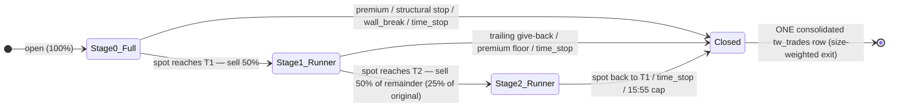

# TradeWorkz Exit Strategy — Architecture & Design

**Status:** In design. The tightened premium stop (§6.1) is **implemented**; the
scale-out ladder (§4–§7) is **specified and pending implementation**.

**Scope:** How the TradeWorkz bot fleet decides *when and how much* to exit an
open position — targets, stop-losses, time-stops — and the design for a
three-tier scale-out / trailing-runner exit that replaces today's
all-or-nothing exit for trades that go into profit.

**Audience:** Anyone touching `src/tradeworkz/bots/base.py`,
`src/tradeworkz/reconciler.py`, `src/tradeworkz/engine.py`,
`src/tradeworkz/simulate.py`, or the `tw_positions` / `tw_trades` schema.

---

## Table of contents

1. [How exits work today (as-is)](#1-how-exits-work-today-as-is)
2. [Bookkeeping & accounting invariants (as-is)](#2-bookkeeping--accounting-invariants-as-is)
3. [Why change it](#3-why-change-it)
4. [The scale-out ladder (to-be)](#4-the-scale-out-ladder-to-be)
5. [Locked design decisions & rationale](#5-locked-design-decisions--rationale)
6. [Stop-loss model](#6-stop-loss-model)
7. [Consolidated bookkeeping (to-be)](#7-consolidated-bookkeeping-to-be)
8. [Data-model & config changes](#8-data-model--config-changes)
9. [Implementation plan](#9-implementation-plan)
10. [Risks & open questions](#10-risks--open-questions)

---

## 1. How exits work today (as-is)

### 1.1 Targets are underlying-spot price *levels*, derived per strategy

Every bot sets `target_price` and `stop_price` on its `TradeSignal` at entry
(`src/tradeworkz/models.py:26-50`). These are **absolute price levels of the
underlying spot** — *not* percentages, *not* option-premium levels. The value
is a concrete price, but each bot *derives* that price from a structural
reference specific to its thesis, so "specific price / specific % / specific
level / conditional on strategy" are all partly true at once: it is a **spot
price, computed from a structural level, and which level is used is conditional
on the strategy.**

| Bot | Target derived from | Stop derived from |
| --- | --- | --- |
| `bull_momentum_climber` | `snap.call_wall` (`bots/bull_momentum_climber.py:105`) | `snap.gamma_flip` (`:106`) |
| `max_pain_gravitator` | `snap.max_pain` (`bots/max_pain_gravitator.py:55`) | derived level |
| `vwap_reversion_scalper` | `snap.vwap` (`bots/vwap_reversion_scalper.py:56`) | derived level |
| `gamma_flip_breaker` / `defender` | gamma-flip level | gamma-flip level |
| `opening_range_hunter` | opening-range extension | opening-range edge |
| `put_wall_magnet_reversal` | wall level | `None` — relies on wall-break + premium stop (`:181`) |
| `put_call_wall_bouncer` | wall level | `None` — same |

### 1.2 The exit is evaluated every tick, and it is all-or-nothing

The engine loop marks each open position, then asks the bot for an exit
decision, and closes the **entire** position if told to
(`src/tradeworkz/engine.py:215-225`):

```python
for pos in load_open_positions(conn, bot_id):
    if pos.underlying != u:
        continue
    mark = mark_position(conn, pos)
    if mark is None:
        continue
    decision = bot.exit_criteria(snap, pos)
    if decision.should_close:
        close_position(conn, pos, reason=decision.reason or "signal")
```

`BaseBot.exit_criteria` (`src/tradeworkz/bots/base.py:152-231`) evaluates, in
order:

1. **Premium damage-control stop** (`:196-205`) — fires *regardless* of the
   min-hold window. If `1 - current_price/entry_price >= max_premium_loss_pct`,
   close with `reason="premium_stop"`. See §6.1.
2. **Structural target** (`:208-212`) — compared against `snap.spot`:
   bullish exits when `spot >= target_price`, bearish when `spot <= target_price`.
3. **Structural stop** (`:213-217`) — bullish exits when `spot <= stop_price`,
   bearish when `spot >= stop_price`.
4. **Time-stop** (`:221-222`) — close when `now >= time_stop_at`.
5. **Wall-break / wall-shift** (`:228-230`, `_wall_stop_signal` `:292-342`) —
   for wall-fade bots that set `wall_ref_side`.

Two timing gates shape this:

- **`min_hold_until`** (`:180-181`) — price-level exits (target/structural stop)
  are suppressed until `MIN_HOLD_SECONDS` (default **90 s**,
  `config.py:57`) elapse, so a wick can't unwind the thesis instantly. The
  premium stop and time-stop are *not* gated.
- **`time_stop_at`** — set by each bot from `max_hold_minutes` (30–180 min
  depending on bot), then **hard-capped at 15:55 ET** on the earliest leg's
  expiration by the reconciler (`_EXPIRATION_CLOSE_HHMM`,
  `reconciler.py:35`, `_cap_time_stop_at_expiration:71-96`). A 0DTE can never
  ride past 15:55 ET.

### 1.3 The partial-exit scaffolding exists but is unwired

`ExitDecision` (`models.py:53-62`) already carries `should_cut`, `cut_fraction`,
`should_add`, `add_fraction` — but **nothing in `engine.py` or `reconciler.py`
reads them** (verified). The default `exit_criteria` only ever returns
`should_close`. These dormant fields are the natural attachment point for the
scale-out ladder (§9).

---

## 2. Bookkeeping & accounting invariants (as-is)

A position lives in `tw_positions` (fast per-tick lookup); on close the row is
**deleted** and one immutable row is written to the `tw_trades` blotter, in the
same transaction (`reconciler.close_position:353-470`,
`schema.sql:2474-2523`).

`close_position` does five things atomically:

1. **Insert one `tw_trades` row** (`:378-409`): `quantity`, `entry_price`,
   `exit_price`, `realized_pnl`, `pnl_percent`, `outcome`, `close_reason`,
   `components_at_exit`.
2. **Delete the `tw_positions` row** (`:413`).
3. **Credit `tw_bot_capital`** by `realized` (`:414-423`).
4. **Update ML state** — one `online_update` sample with `won=(outcome=="win")`
   plus a defensive `recalibrate_bot` (`:425-450`).
5. **Fan out an `exit` event** to `tw_notifications_log`, the delivery **audit
   trail** (`:452-469`, `schema.sql:2592-2604`).

P&L for these long-debit structures is
`realized = (exit_price − entry_price) × quantity × 100` (`:365-366`).

These are guarded by `setup/database/diagnostics/tradeworkz_invariants.sql`
(run via `make tradeworkz-check`). The ones that constrain any new exit logic:

- **Invariant A** (`:33-43`): for every live closed trade,
  `realized_pnl == (exit_price − entry_price) × quantity × 100`. The recorded
  `exit_price` must be arithmetically consistent with `realized_pnl` and
  `quantity`. **This is the binding constraint on a consolidated multi-tranche
  close — see §7.**
- **Invariant B** (`:57-73`): per bot,
  `current_capital − starting_capital == Σ realized_pnl` over live trades. Every
  dollar credited to capital must be backed by exactly one trade row.
- **Invariant C** (`:84-93`): `outcome` sign matches `realized_pnl`.

---

## 3. Why change it

Today a winner is capped and exited whole the instant spot touches its single
structural target — there is **no runner**. On the downside, an un-stopped
winner can round-trip all the way back to the premium stop and give everything
back. The base class flags exactly this failure mode in its own docstring. For a
0DTE ATM debit, a move that goes +60% and reverses can hand the entire gain
back before any structural stop is reached.

Booking part of the position at the first target and trailing the rest is the
standard fix. It reduces variance (a real win is locked in early) and lets the
occasional strong trend pay for the many scratches — which the current
single-target exit structurally cannot capture.

---

## 4. The scale-out ladder (to-be)

Applies **only to positions in profit**. The existing stop-loss stack (§6)
remains in force throughout — the ladder governs how *profits* are harvested; it
does not loosen downside control.



**Stage 0 — full position (pre-T1).** Governed exactly as today: structural
target = **T1**, structural stop, premium stop, wall-break, time-stop. If any
fires here, the whole position closes as it does now.

**T1 hit (spot reaches T1): take 50%.** Sell `floor(0.5 × Q)` contracts. Enter
Stage 1. The taken profit is *booked* (§7) but no trade row is written yet.

**Stage 1 — runner (the remaining ~50%).**
- **Target = T2**, a measured extension beyond T1 (§5a).
- **Trailing stop = premium give-back** from the runner's high-water mark (§5b).
- The premium hard-floor and time-stop remain as backstops.

**T2 hit (spot reaches T2): take 50% of the remainder (25% of original).**
Enter Stage 2.

**Stage 2 — final runner (the last ~25%).**
- **Stop = original T1** (spot level): if spot falls back to T1, exit. This
  guarantees the final tranche cannot give back below the T1-level move.
- **Ride** until the time-stop / 15:55 ET cap.

**Terminal.** When the last tranche exits by any reason, write **one**
consolidated `tw_trades` row (§7).

### Worked example (why the record stays honest)

Entry premium `1.00`, `Q = 4` contracts. T1 fills 2 @ `1.60`; T2 fills 1 @
`2.00`; the final runner stops back at T1, filling 1 @ `1.40`.

- Size-weighted exit = `(2×1.60 + 1×2.00 + 1×1.40) / 4 = 6.60 / 4 = 1.65`
- Consolidated `realized_pnl = (1.65 − 1.00) × 4 × 100 = $260`
- Tranche sum = `120 + 100 + 40 = $260` ✓ — identical, so **Invariant A holds**.

One `tw_trades` row: `quantity=4`, `exit_price=1.65`, `realized_pnl=260`,
`pnl_percent=0.65`, with the three tranches enumerated in `components_at_exit`.

---

## 5. Locked design decisions & rationale

**(a) Where T2 sits — measured extension.** `T2 = T1 + m × (T1 − entry_spot)`
in the favorable direction, default `m = 1.0` (i.e. a 2R move from entry, T1
being 1R). Chosen over "next structural level" because **not every bot has a
clean second level** (many target max-pain / VWAP with nothing obvious beyond),
whereas a measured extension is universal and backtestable with one knob. This
requires storing **`entry_spot`**, which the position does not persist today
(only `entry_price`, the option premium). `m` is configurable per-bot.

**(b) Trailing stop — premium give-back, not spot trail.** The Stage-1 runner
exits when its option mark gives back `≥ runner_trail_giveback_pct` (default
30%) from its **high-water mark**. Premium-based rather than spot-based because
on 0DTE **theta** erodes the mark even when spot holds; a spot trail ignores
that decay, a premium give-back captures it directly.

**(c) Ride-to-EOD applies on all tiers, 0DTE included.** Not made
tier-dependent. The runner is already protected by the trailing give-back
(Stage 1) and the T1-lock (Stage 2), and the reconciler's 15:55 ET hard cap
bounds the hold. Keeping one uniform rule is simpler and the protections make it
safe. **Caveat:** per the user's ladder, Stage 2's only price stop is at
original T1; a big T2 winner can still bleed some gains to theta before the T1
stop or 15:55 cap. This is an accepted property of the specified strategy — see
§10 for the optional Stage-2 trailing knob.

**Tranche fractions.** 50% at T1, then 50% of the remainder at T2 (25% of
original), leaving 25% to ride — configurable (`t1_take_fraction`,
`t2_take_fraction`, default 0.5 / 0.5).

**Minimum-contract floor.** Scaling requires `quantity_initial ≥
min_scale_contracts` (default 4). Below that, the position uses today's
single-target behavior — halving tiny positions produces 1-contract tranches
and triples per-fill slippage (`EXECUTION_SLIPPAGE_PCT`, `config.py:64`) for no
diversification benefit. Integer rounding: `t1 = floor(Q/2)`, `t2 =
floor((Q−t1)/2)`, `runner = Q − t1 − t2` (Q=4 → 2/1/1; Q=6 → 3/1/2).

---

## 6. Stop-loss model

Three independent layers, all still in effect under the new ladder:

### 6.1 Premium damage-control stop — **now 25%** (configurable)

If the option mark drops below `(1 − MAX_PREMIUM_LOSS_PCT) × entry_price`, the
reconciler closes the position with `reason="premium_stop"`
(`base.py:196-205`). **Default lowered from 40% → 25%** this change
(`config.py:75-77`, `.env.example:1438`).

- Fleet-wide via `TRADEWORKZ_MAX_PREMIUM_LOSS_PCT`.
- Per-bot via `params['max_premium_loss_pct']`, which overrides the fleet
  default (`base.py:126-144`). `0` disables it for that bot.
- Only `put_wall_magnet_reversal` overrides it today (already `0.25`,
  `bots/put_wall_magnet_reversal.py:81`); it is now equal to the fleet default.
  Every other bot inherits the new 25% cap.

Note the interaction with the runner: the premium stop is measured from
**entry**. Once a trade is a large winner, the `(1 − 0.25)×entry` floor sits far
below the current mark and no longer meaningfully protects *unrealized gains* —
that job belongs to the trailing give-back (Stage 1) and the T1-lock (Stage 2).
The premium stop is the Stage-0 / catastrophic floor.

### 6.2 Structural spot stop

Per-bot `stop_price` at a spot invalidation level (e.g. gamma flip). Some bots
set `None` and rely on 6.1 + 6.3. Once the ladder passes T1, the runner's
downside is governed by the trailing give-back / T1-lock rather than the
original structural stop (which sat below entry).

### 6.3 Wall-break / wall-shift stop

For wall-fade bots, a volatility-scaled break of the referenced wall
(`_wall_stop_signal`, `base.py:292-342`). Unchanged.

### 6.4 Time-stop / EOD

`time_stop_at` from `max_hold_minutes`, hard-capped at 15:55 ET (§1.2).
Unchanged; it is the final backstop for the Stage-2 runner.

---

## 7. Consolidated bookkeeping (to-be)

**Requirement (locked):** a scaled trade records as **one** consolidated
`tw_trades` row at final exit, and that row — plus the audit trail — must
faithfully represent what actually happened.

### 7.1 Partial closes do not write trades or move capital

When T1 or T2 fires, a new `partial_close_position(conn, pos, cut_qty, reason)`:

1. Prices the tranche (`spread_price(..., action="close")`).
2. Reduces `tw_positions.quantity_open` by `cut_qty`.
3. Accumulates `tw_positions.realized_pnl_booked += (fill − entry) × cut_qty × 100`.
4. Appends the tranche to `tw_positions.exit_tranches` (JSONB):
   `{price, qty, reason, realized, ts}`.
5. Re-marks `unrealized_pnl` on the remaining `quantity_open`.
6. Emits a `scale` event to `tw_notifications_log` (audit trail) with the
   tranche detail.

It **does not** touch `tw_bot_capital` and **does not** write `tw_trades`.

### 7.2 The final close writes one arithmetically-honest row

When the last tranche exits, `close_position` writes a single `tw_trades` row:

- `quantity = quantity_initial` (the original total).
- `exit_price =` **size-weighted average** over all tranches (incl. the final
  one): `Σ(fillᵢ × qtyᵢ) / quantity_initial`.
- `realized_pnl = realized_pnl_booked + final-tranche realized`.
- `pnl_percent = exit_price / entry_price − 1`.
- `outcome = sign(realized_pnl)`.
- `close_reason =` the terminal reason of the **final** tranche (e.g.
  `runner_time_stop`, `runner_trail_stop`, `runner_t1_lock`), or the ordinary
  Stage-0 reason if the position never scaled.
- `components_at_exit =` `{ exit_reason, weighted_exit, scale_stage_reached,
  tranches: [...] }` — the full per-tranche breakdown behind the consolidated
  number.

Then, atomically: credit `tw_bot_capital` by the full `realized_pnl`, delete the
position, run **one** ML `online_update`, and fan out one `exit` event carrying
the consolidated totals and the tranche summary.

**Why size-weighted exit:** it makes Invariant A hold *by construction* —
`(weighted_exit − entry) × quantity_initial × 100 ≡ Σ(fillᵢ − entry) × qtyᵢ ×
100 = realized_pnl` (see the §4 worked example). No invariant needs to change.

### 7.3 Consequences (kept honest)

- **One trade = one ML sample** — scaling does not multiply training samples or
  distort win-rate; `won` reflects the *net* outcome. Matches today's semantics.
- **Invariants A, B, C hold unchanged** — one capital credit backed by one trade
  row whose arithmetic is self-consistent.
- **Accepted tradeoff — intraday NAV lag.** Because capital is credited only at
  final close, profit taken at T1/T2 lands in `tw_bot_capital` and the
  daily-kill basis (`daily_realized_pnl` sums `tw_trades`, `reconciler:473-490`)
  at *final* close, not when the tranche is taken. For a fleet that always closes
  same-day by 15:55 ET the lag is within-session and acceptable; the booked
  realized is still visible on the position via `realized_pnl_booked` and every
  `scale` audit event. If live intraday sleeve NAV on partially-closed positions
  ever becomes a product requirement, the alternative ("Design 1b") is to credit
  capital per tranche and extend Invariant B to add
  `SUM(tw_positions.realized_pnl_booked)` for open positions — deferred until
  needed to keep the audit invariants pristine.

---

## 8. Data-model & config changes

### 8.1 New `tw_positions` columns

Applied as idempotent `ALTER TABLE tw_positions ADD COLUMN IF NOT EXISTS …` in
`schema.sql` (the repo's migration convention — see the `option_chains` blocks
around `schema.sql:145-157`; there is no separate migrations directory).

| Column | Type | Purpose |
| --- | --- | --- |
| `entry_spot` | `NUMERIC(12,6)` | Underlying spot at entry — for T2 measured extension & audit |
| `quantity_initial` | `INTEGER` | Original contract count — tranche sizing & consolidated `quantity` |
| `target2_price` | `NUMERIC(12,6)` | Computed T2 spot level |
| `scale_stage` | `SMALLINT NOT NULL DEFAULT 0` | 0 = full, 1 = post-T1, 2 = post-T2 |
| `high_water_mark` | `NUMERIC(12,6)` | Peak mark for the premium trailing give-back |
| `realized_pnl_booked` | `NUMERIC(14,4) NOT NULL DEFAULT 0` | Accumulated realized from partial closes |
| `exit_tranches` | `JSONB NOT NULL DEFAULT '[]'` | Per-tranche audit breakdown |

`target_price` continues to hold **T1** throughout (the Stage-2 stop reads it).
`quantity_open` continues to hold the *currently open* count. Existing rows
migrate cleanly (all new columns nullable/defaulted); `quantity_initial` /
`entry_spot` backfill from `quantity_open` / a null-safe default for any
in-flight position at deploy.

`tw_trades` needs **no schema change** — `components_at_exit` (JSONB) already
carries the tranche breakdown.

### 8.2 New config knobs (`config.py`, `.env.example`)

All read via `config.py` and overridable per-bot through `params[...]`, mirroring
`max_premium_loss_pct`:

| Env | Default | Meaning |
| --- | --- | --- |
| `TRADEWORKZ_SCALE_OUT_ENABLED` | `true` | Master switch; `false` = today's single-target exit |
| `TRADEWORKZ_MIN_SCALE_CONTRACTS` | `4` | Below this initial size, don't scale |
| `TRADEWORKZ_T1_TAKE_FRACTION` | `0.5` | Fraction of original taken at T1 |
| `TRADEWORKZ_T2_TAKE_FRACTION` | `0.5` | Fraction of the *remainder* taken at T2 |
| `TRADEWORKZ_T2_EXTENSION_MULT` | `1.0` | `T2 = T1 + m·(T1 − entry_spot)` |
| `TRADEWORKZ_RUNNER_TRAIL_GIVEBACK_PCT` | `0.30` | Premium give-back from HWM that stops the runner |

`TRADEWORKZ_MAX_PREMIUM_LOSS_PCT` default changed `0.40 → 0.25` (§6.1) — done.

---

## 9. Implementation plan

Ordered so each step is independently testable.

1. **Schema** — add the §8.1 columns to `schema.sql`; extend
   `reconciler.load_open_positions` and the `OpenPosition` dataclass
   (`models.py:95-117`) to hydrate them.
2. **Config** — add the §8.2 knobs; add per-bot resolvers on `BaseBot`
   alongside `_max_premium_loss_pct`.
3. **Ladder decision** — extend `BaseBot.exit_criteria` (or a new
   `_scale_exit_decision`) to: compute/persist `entry_spot`, `target2_price`,
   `quantity_initial`, `high_water_mark`; emit `should_cut` + `cut_fraction`
   for T1/T2; advance `scale_stage`; apply the Stage-1 trailing give-back and
   the Stage-2 T1-lock. Gate on `SCALE_OUT_ENABLED` and the min-contract floor —
   when off, behaviour is byte-for-byte today's.
4. **Wire `should_cut`** — the engine loop (`engine.py:222-225`) handles
   `decision.should_cut` → `partial_close_position`, in addition to
   `should_close`. This activates the dormant `ExitDecision` fields.
5. **Partial close** — add `partial_close_position` (§7.1).
6. **Consolidated close** — extend `close_position` (§7.2) to compute the
   size-weighted exit and merge `realized_pnl_booked` + `exit_tranches`.
7. **Notifications** — add the `scale` event type to `notifications.fanout_event`
   and the follower fan-out; decide dust-filter handling (treat like `exit`).
8. **Backtest/sim parity** — mirror the ladder in `src/tradeworkz/simulate.py`
   so backtests and live trading agree (the invariants file already exempts sim
   rows from Invariant A's exact arithmetic).
9. **Tests** — new cases: stage transitions; the VWAP-consolidation identity
   (Invariant A holds after a 3-tranche close); single capital credit (B);
   single ML sample; min-contract floor skip; trailing give-back; Stage-2
   T1-lock; integer rounding; interaction with `min_hold` and the 15:55 cap.
10. **Invariant check** — run `make tradeworkz-check`; add a scale-specific
    assertion that `Σ exit_tranches.realized == realized_pnl` for scaled rows.

---

## 10. Risks & open questions

- **0DTE theta on the Stage-2 runner.** Per the locked spec, Stage 2's only
  price stop is at original T1. A trade that reaches T2 can still surrender part
  of that gain to decay before the T1 stop or the 15:55 cap. *Optional mitigation
  (not default):* a `runner_trail_in_stage2` flag that keeps the premium
  give-back active on the final tranche too. Left off to honour the specified
  ladder; easy to enable per-bot if backtests favour it.
- **Deferred capital credit.** §7.3 — intraday sleeve NAV and the daily-kill
  basis see scaled profit only at final close. Acceptable for a same-day-close
  fleet; "Design 1b" is the escape hatch if not.
- **Slippage on extra fills.** Three exits instead of one triples per-tranche
  slippage; the min-contract floor bounds this, but the `T2_EXTENSION_MULT` and
  give-back defaults should be validated against slippage drag in backtests
  before fleet-wide enablement.
- **Backtest parity is load-bearing.** If `simulate.py` is not updated in
  lockstep (step 8), the leaderboard/backtests will diverge from live behaviour.
