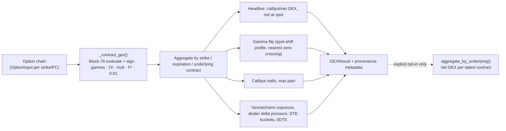

# Futures Calculations — Black-76, GEX Engine, Dealer Sign

This document covers how ES/NQ analytics are computed: **Black-76** pricing and
Greeks for options on futures, the contract-aware, multiplier-aware **futures
GEX engine**, and the versioned **dealer-sign policy**.

> **These are true CME futures-options analytics** (`analytics_source =
> cme_futures_options`). They are distinct from the cash-index/ETF OPRA
> analytics (Black-Scholes-Merton, multiplier 100) and from the SPX-derived ES
> reference (see [futures-reference-mode.md](./futures-reference-mode.md)). A
> Black-76 futures Greek and an equity BSM Greek are **never** interchangeable.

See [futures-data-model.md](./futures-data-model.md) for the objects that feed
these engines.

---

## 1. Black-76 (`src/futures/black76.py`)

Options on ES/NQ futures are priced with the **Black-76** model (Black 1976),
**not** the Black-Scholes-Merton spot model used for cash-index/ETF options
(`src/greeks_fd.py`, `src/ingestion/greeks_calculator.py`). The difference is
not cosmetic:

- The underlying is the **futures price F**, which already embeds cost-of-carry
  — so there is **no separate spot and no dividend yield q**, and the drift term
  in `d1` is `+½σ²T` (no `r − q`).
- The premium is **discounted at r** (standard premium-paid equity-style option):
  the premium and every Greek carry the `e^{-rT}` factor.
- **Futures delta ≠ equity delta.** A Black-76 delta is the sensitivity to a
  1-point move in the *future*, hedged with the *future itself* — never
  interchangeable with an equity/index delta. Every result tags
  `delta_convention = "futures"`.

### 1.1 Formulas

With F futures price, K strike, T years, r rate, σ vol; N = normal CDF, n = pdf:

```
d1 = [ln(F/K) + ½σ²T] / (σ√T)          d2 = d1 − σ√T
call = e^{-rT}[F·N(d1) − K·N(d2)]
put  = e^{-rT}[K·N(−d2) − F·N(−d1)]

delta_call = e^{-rT}·N(d1)             delta_put = −e^{-rT}·N(−d1)
gamma      = e^{-rT}·n(d1) / (F·σ√T)          (same for calls and puts)
vega       = F·e^{-rT}·n(d1)·√T               (per 1.00 vol, annual)
theta_yr   = r·price − F·e^{-rT}·n(d1)·σ/(2√T) (per year)
rho        = −T·price                          (per 1.00 rate)
```

**Vanna and charm** are computed by **central/backward finite differences of the
Black-76 delta**, matching the deliberate house choice in `greeks_fd.py`
(correct-by-construction, immune to closed-form sign bugs, and automatically
consistent with whatever `r`/day-count is configured).

### 1.2 Reported units (documented and carried on the result)

`Black76Result` echoes its own units so consumers never guess:

| Greek | Unit | Field/tag |
| --- | --- | --- |
| `delta` | per 1.0 change in F (dimensionless) | `delta_convention = "futures"` |
| `gamma` | per 1.0 change in F (1/point) | — |
| `vega` | per **1% (0.01)** change in σ (annual × 0.01) | `vega_unit = "per_1pct_vol"` |
| `theta` | per **calendar day** (annual ÷ 365) | `theta_unit = "per_calendar_day"` |
| `rho` | per **1% (0.01)** change in r | `rho_unit = "per_1pct_rate"` |
| `vanna` | d(delta)/dσ per 1.00 vol | — |
| `charm` | d(delta)/dt per **calendar day** | — |

Day count is **calendar 365** (`DAY_COUNT = 365.0`), matching
`src/market_calendar.calculate_time_to_expiration`.

### 1.3 Public API

```python
d1_d2(F, K, T, sigma) -> (d1, d2)
price(futures_price, strike, t_years, sigma, is_call, rate=0.0) -> float
delta(futures_price, strike, t_years, sigma, is_call, rate=0.0) -> float
evaluate(futures_price, strike, t_years, sigma, is_call, rate=0.0) -> Black76Result
implied_volatility(market_price, futures_price, strike, t_years, is_call, rate=0.0, ...) -> Optional[float]
years_to_expiration(now, expiration, *, min_minutes=0.0) -> float
```

`evaluate()` returns a `Black76Result` whose `quality` (`ModelQuality`) flags
degenerate regimes rather than raising:

- `GOOD` — normal.
- `EXPIRED` — `T ≤ 0` or `σ ≤ 0`; priced at discounted intrinsic, Greeks
  degenerate.
- `INVALID_INPUT` — a non-finite / non-positive input; result is a safe zero.
- `IV_UNRESOLVED` — the IV solve saturated a bound / did not converge (used on
  the GEX path).

`is_usable` is True for `GOOD` and `EXPIRED`.

### 1.4 IV solver

`implied_volatility()` uses **Newton-Raphson with a bisection fallback** across
the full band. It returns `None` when the price is below discounted intrinsic,
above the discounted upper bound, the option is expired, or the target is not
bracketed — the same *"leave it NULL rather than fabricate"* contract as the
equity IV solver (`src/ingestion/iv_calculator.py`). Solver defaults mirror the
equity path: `IV_MIN=0.01`, `IV_MAX=5.0`, `TOLERANCE=1e-5`,
`MAX_ITERATIONS=100`.

### 1.5 Verified reference point

The implementation is verified against a hand-computed ATM reference with
`F = K = 100`, `T = 1`, `σ = 0.2`, `r = 0.05`:

| Quantity | Expected |
| --- | --- |
| call price | ≈ 7.5775 |
| delta | ≈ 0.5135 |
| gamma | ≈ 0.018880 |
| vega (per 1%) | ≈ 0.37760 |

---

## 2. Futures GEX engine (`src/futures/gex.py`)

`FuturesGexEngine.compute()` produces **true futures-options gamma exposure**
from CME ES/NQ option chains using Black-76 Greeks and the futures contract
multiplier — **never** the hardcoded equity `100`.

### 2.1 GEX formula

The platform's existing *dollar gamma per 1% move* unit is preserved, but with
the **futures multiplier** (50 ES / 20 NQ, from the option's own multiplier):

```
dealer_signed_gex = dealer_sign
                    × gamma            (Black-76, 1/point)
                    × open_interest
                    × contract_multiplier   (50 ES / 20 NQ, NOT 100)
                    × futures_price²
                    × 0.01
```

The multiplier is the single most important difference from the equity path.
Related per-contract exposures:

```
delta_exposure = sign × delta × OI × multiplier
vanna_exposure = sign × vanna × OI × multiplier × F × 0.01
charm_exposure = sign × charm × OI × multiplier × F
```

### 2.2 What it computes

From a chain of `OptionInput` (strike, put_call, OI, exact expiration,
`underlying_contract_id`, multiplier, and either `iv` or `market_price`), for a
given `futures_price` and `now`:

- call / put / **net** GEX, and net GEX **at spot**
- **by strike** (`StrikeGEX`: call_gex, put_gex, net_gex)
- **by expiration** and **by underlying contract**
- **gamma flip** — nearest zero-crossing of the spot-shifted dealer gamma
  profile (repriced from solved per-contract IV over a ±20% grid)
- **call wall / put wall** (`Wall`: strike, strength)
- **max pain**
- **vanna / charm exposure** totals and **dealer delta pressure**
- **DTE buckets** (`0dte / 1-5 / 6-30 / 30+`) and a `zero_dte_net_gex`

When only a market price is supplied the engine solves Black-76 IV; a contract
whose IV cannot be solved is flagged `iv_unresolved` and contributes zero GEX
(never a fabricated value).

### 2.3 Provenance metadata (every result)

`GEXResult` carries explicit provenance so a consumer can always tell genuine
CME futures-options GEX apart from anything else and know exactly how it was
produced:

| Field | Meaning |
| --- | --- |
| `logical_symbol` | e.g. `ES` |
| `resolved_contract` | the dated contract analytics were attributed to (e.g. `ESZ25`) |
| `contract_expiration` | ISO instant |
| `analytics_source` | `cme_futures_options` |
| `data_timestamp` | `now` (ISO) |
| `open_interest_as_of` | OI snapshot instant |
| `futures_price` | F used |
| `multiplier` | 50 / 20 |
| `calculation_version` | `"futures_gex_v1"` |
| `gex_unit` | `"dollar_gamma_per_1pct_move"` |
| `dealer_sign_policy` | policy version string |
| `quality_status` | `good` / `degraded` / `unavailable` |
| `quality_reasons` | list of human-readable reasons |

`quality_status` is `good` with no issues, `degraded` when there are reasons but
some per-contract results exist, `unavailable` when nothing usable could be
computed.

### 2.4 Cross-maturity aggregation seam

Analytics are computed **per underlying futures contract** and only then
optionally aggregated, so options on different maturities are never blindly
summed onto one price axis.

```python
aggregate_by_underlying(results: Sequence[GEXResult]) -> Dict[str, float]
```

This is the **only** seam that combines maturities, and it sums net GEX **per
dated contract** — a caller must opt in, and can always inspect each contract
separately. `compute()` itself never mixes price coordinates.



### 2.5 Engine configuration

```python
FuturesGexEngine(
    risk_free_rate=0.05,               # FUTURES_RISK_FREE_RATE
    sign_policy=DEFAULT_SIGN_POLICY,   # see §3
    analytics_source="cme_futures_options",
    profile_span_pct=0.20,             # gamma-flip grid ±20%
    profile_step_pct=0.005,
    min_minutes_to_expiry=30.0,        # floor on T so near-expiry is stable
)
```

---

## 3. Dealer-sign policy (`src/futures/sign_policy.py`)

Dealer-sign is the assumption about which way market makers are positioned in
each contract — it flips the sign of every exposure and therefore the entire GEX
regime. The SPY/SPX/QQQ calibration must **not** be assumed correct for ES/NQ,
so the policy is **versioned, documented, independently configurable for CME
products, and exposed in calculation metadata**.

```python
@runtime_checkable
class DealerPositionSignPolicy(Protocol):
    version: str                                  # echoed in GEX metadata
    def sign_for_contract(self, put_call: PutCall) -> int: ...
```

| Policy | Version | Calls | Puts |
| --- | --- | --- | --- |
| `LongCallShortPutSignPolicy` (default) | `v1_calls_long_puts_short` | +1 | −1 |
| `InvertedSignPolicy` | `v1_calls_short_puts_long` | −1 | +1 |

The default mirrors the existing ZeroGEX equity convention (dealers modeled
net-long calls / net-short puts, same as `src/analytics/main_engine.py`). It is
applied to ES/NQ as a **starting calibration**, explicitly flagged as such via
`version` in metadata, so a future CME-specific recalibration is a drop-in
replacement — not a silent change.

`get_sign_policy(version)` resolves a policy by id (defaulting to the standard
one); `FUTURES_DEALER_SIGN_POLICY` selects it via config, letting an operator
flip the whole book's assumed sign without editing engine code.

> The CME dealer-sign calibration is a **pending validation** item — see the
> external-dependencies section of
> [futures-support-architecture.md](./futures-support-architecture.md) and
> [futures-deployment.md](./futures-deployment.md).
