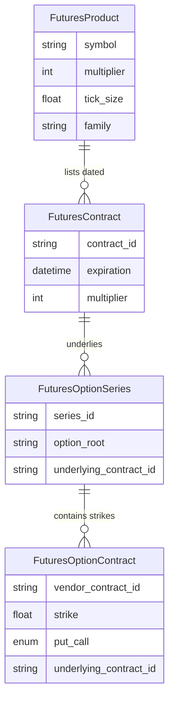

# Futures Data Model

This document covers the data structures behind first-class ES/NQ support: the
centralized **instrument registry**, the **futures domain objects**, the
**database tables**, and the **security-definition** ingestion layer. It is the
reference for *what a futures instrument is made of*.

See [futures-support-architecture.md](./futures-support-architecture.md) for the
big picture and [futures-calculations.md](./futures-calculations.md) for how
these objects feed the pricing/GEX engines.

---

## 1. Instrument registry (`src/instruments.py`)

The registry is the single source of truth for *what an instrument is* — its
asset class, product family, exchange, analytics source, market calendar, and
contract economics. It exists so the rest of the codebase asks capability /
metadata questions (`is_future(sym)`, `contract_multiplier(sym)`,
`analytics_source(sym)`) instead of scattering `symbol in ("ES", "NQ")`
conditionals.

The frontend ships a parallel registry (`core/instruments/registry.ts`) kept
intentionally consistent; `GET /api/instruments` lets the frontend reconcile
against server-side availability at runtime.

### 1.1 Enumerations

```python
class AssetClass(str, Enum):
    ETF = "etf"
    INDEX = "index"
    FUTURE = "future"

class AnalyticsSource(str, Enum):
    OPRA_EQUITY_OPTIONS = "opra_equity_options"     # SPY/QQQ/SPX/NDX today
    CME_FUTURES_OPTIONS = "cme_futures_options"     # the TRUE futures-options source
    CASH_INDEX_PROJECTION = "cash_index_projection" # interim SPX-derived ES reference

class MarketCalendarId(str, Enum):
    US_EQUITIES = "us_equities"          # NYSE/Nasdaq 09:30-16:00 ET (extended 04:00-20:00)
    US_CASH_INDEX = "us_cash_index"      # underlying prints only 09:30-16:00 ET
    CME_EQUITY_INDEX = "cme_equity_index" # CME Globex Sun 18:00 ET -> Fri 17:00 ET

class InstrumentFamily(str, Enum):
    SP500 = "sp500"
    NASDAQ100 = "nasdaq100"
```

The three `AnalyticsSource` values are the machine-readable form of the
three-way distinction from the architecture doc. `CASH_INDEX_PROJECTION` must
**never** be presented as `CME_FUTURES_OPTIONS`.

### 1.2 `InstrumentDefinition`

Immutable (`@dataclass(frozen=True)`) metadata for one tradable instrument:

```python
@dataclass(frozen=True)
class InstrumentDefinition:
    symbol: str
    display_symbol: str
    name: str
    family: InstrumentFamily
    asset_class: AssetClass
    exchange: str
    analytics_source: AnalyticsSource
    market_calendar: MarketCalendarId
    capabilities: InstrumentCapabilities
    currency: str = "USD"
    contract_multiplier: int = 100          # 100 equity/index, 50 ES, 20 NQ
    price_increment: Optional[float] = None # 0.25 for ES/NQ, None for equities
    reference_source_symbol: Optional[str] = None  # SPX for ES; None for NQ
    price_precision: int = 2

    @property
    def is_future(self) -> bool: ...        # asset_class is FUTURE
    @property
    def is_cash_index(self) -> bool: ...     # asset_class is INDEX
```

The six registered instruments (registry / display order is preserved to keep
the existing product unchanged):

| Symbol | Name | Family | Class | Exchange | Multiplier | Tick | Analytics source | Calendar | Ref source |
| --- | --- | --- | --- | --- | --- | --- | --- | --- | --- |
| SPY | SPDR S&P 500 ETF Trust | sp500 | etf | ARCA | 100 | — | opra_equity_options | us_equities | — |
| SPX | S&P 500 Index | sp500 | index | CBOE | 100 | — | opra_equity_options | us_cash_index | — |
| QQQ | Invesco QQQ Trust | nasdaq100 | etf | NASDAQ | 100 | — | opra_equity_options | us_equities | — |
| NDX | Nasdaq-100 Index | nasdaq100 | index | NASDAQ | 100 | — | opra_equity_options | us_cash_index | — |
| **ES** | E-mini S&P 500 Futures | sp500 | future | CME | **50** | 0.25 | cme_futures_options | cme_equity_index | **SPX** |
| **NQ** | E-mini Nasdaq-100 Futures | nasdaq100 | future | CME | **20** | 0.25 | cme_futures_options | cme_equity_index | **None** |

`DEFAULT_ENABLED_SYMBOLS = ["SPY", "SPX", "QQQ", "NDX"]` — the equity/index set
that ships enabled today.

The registry deals only in **logical symbols** (`ES`) and public exchange
metadata. The TradeStation continuous symbol (`@ES`) and any other vendor form
stay in `src/symbols.py` / ingestion and are never surfaced here.

### 1.3 Capabilities vs. availability

`InstrumentCapabilities` are the **static** capability of the asset class (does
GEX even make sense?). Runtime **availability** — is data actually being
ingested — is layered on top.

```python
@dataclass(frozen=True)
class InstrumentCapabilities:
    quotes / historical_quotes / gex / option_flow / vanna_charm /
    max_pain / signals / replay / backtesting / strategy_builder /
    futures_reference_mode: bool = False
```

- **Equity caps** (`_EQUITY_CAPS`): everything True except `futures_reference_mode`.
- **Future caps** (`_FUTURE_CAPS`): most surfaces True, but `signals=False`
  (not recalibrated for CME) and `strategy_builder=False` (assumes equity-option
  symbology). `futures_reference_mode=True`.

Availability is resolved from the environment:

```python
@dataclass(frozen=True)
class InstrumentAvailability:
    symbol: str
    available: bool        # can a user select this and get SOMETHING real?
    true_analytics: bool   # genuine CME futures-options analytics
    reference_mode: bool   # SPX-derived projection available
    reasons: List[str]
```

Key functions:

- `get_availability(symbol)` — equities are always available; futures require
  `ENABLE_CME_INGESTION` **and** the per-product analytics flag for
  `true_analytics`, and a wired reference source for `reference_mode`.
- `enabled_symbols()` — equities always, futures only when available.
- `effective_capabilities(symbol)` — intersects capabilities with availability.
  For futures, analytics surfaces require `true_analytics`; the reference-mode
  capability is governed separately by `reference_mode`.

This is what API/UI layers consult to render a surface or a clear "unavailable"
state — an unavailable future never looks fully operational.

---

## 2. Futures domain objects (`src/futures/contracts.py`)

These frozen dataclasses mirror the security-definition fields a real CME/vendor
feed publishes, so ingestion can populate them verbatim instead of parsing
critical properties out of display ticker strings at runtime.

Two hard rules enforced by the model:

1. **Exact expiration timestamps, not just dates.** `expiration` on every
   contract/series/option is a timezone-aware `datetime` at the actual
   settlement instant. `__post_init__` raises `ValueError` if it is naive. 0DTE
   classification, Black-76 time-to-expiry, and the CME calendar all depend on
   the instant, not the calendar day.
2. **Decimal-safe economics.** Notional / tick-value conversions use `Decimal`
   so a $50 multiplier on a 6000.25 price never accumulates float error.

### 2.1 Month codes and labels

```python
MONTH_CODES = {1:"F",2:"G",3:"H",4:"J",5:"K",6:"M",
               7:"N",8:"Q",9:"U",10:"V",11:"X",12:"Z"}
QUARTERLY_MONTHS = (3, 6, 9, 12)   # H / M / U / Z — the ES/NQ standard cycle

month_code(month)            # 1-12 -> letter
month_from_code(code)        # inverse
contract_label(sym, y, m)    # e.g. "ESZ25" (2-digit year); DISPLAY only
```

The contract label is a **display label only** — never parsed back for
authoritative fields; the dated-contract object carries the exact expiration.

### 2.2 Decimal-safe economics

```python
notional_value(price, multiplier) -> Decimal   # ES 6000.25 * 50 = Decimal('300012.50')
tick_value(tick_size, multiplier) -> Decimal    # ES 0.25 * 50 = 12.50; NQ 0.25 * 20 = 5.00
```

Coercion goes through `Decimal(str(value))` to avoid binary-float artifacts.

### 2.3 The four objects



**`FuturesProduct`** — the logical product (ES, NQ), the continuous instrument
face. Carries authoritative economics: `symbol`, `name`, `exchange`, `currency`,
`multiplier` (50/20), `tick_size` (0.25), `family`. `tick_value` property.

**`FuturesContract`** — a single dated futures contract (e.g. ES Dec 2025 /
`ESZ25`). The continuous symbol `ES` **always** resolves to one of these;
analytics are attributed to the dated contract, never to the abstract
continuous face. Fields include `product_symbol`, `contract_month/year`,
`expiration` (tz-aware, required), `multiplier`, `tick_size`,
`exchange_symbol`, `vendor_symbol` (kept distinct so a vendor swap never
rewrites analytics keys), trade/settlement dates, `status`, `volume`,
`open_interest`, `is_front_contract`, `is_next_contract`, and a stable
`contract_id` (defaults to the canonical label). Methods: `label`,
`contract_month_code`, `is_expired(as_of)`, `notional(price)`.

**`FuturesOptionSeries`** — a series of options sharing a root, expiry and
underlying. Multiple roots coexist per product (daily EW, weekly, EOM,
quarterly), so `OptionListingType` distinguishes `DAILY / WEEKLY /
END_OF_MONTH / QUARTERLY`. Each series **pins the specific underlying futures
contract** (`underlying_contract_id`) it settles into, so options across
maturities are never blindly co-aggregated. Also carries `option_root`,
`expiration`, `multiplier`, `exercise_style`, `settlement_type`, `series_id`
(defaults to `"{root}:{expiration date}"`).

**`FuturesOptionContract`** — a single strike/put-call option on a dated future.
Carries its own `multiplier` and exact `expiration` so downstream GEX/Greeks
never re-derive them from a display string. `underlying_contract_id` binds it to
the exact futures maturity. Fields: `series_id`, `product_symbol`, `strike`
(must be > 0), `put_call` (`PutCall.CALL`/`PUT`), `exercise_style`,
`settlement_type`, `vendor_contract_id` (authoritative live-lookup key),
`open_interest`, `volume`, `metadata`. Methods: `is_call`,
`intrinsic(futures_price)`.

Supporting enums: `PutCall` (`C`/`P`), `ContractStatus`
(`active/expired/pending/delisted`), `ExerciseStyle` (`american/european`),
`SettlementType` (`futures/cash`).

---

## 3. Database tables (`setup/database/schema.sql`)

Four additive tables hold the **authoritative** contract metadata a real
CME/vendor security-definition feed publishes, so live analytics read exact
expiration instants, multipliers, exercise/settlement styles and the underlying
future an option settles into rather than parsing display tickers. They are
independent of the display-only `futures_quotes` table; populating them requires
`ENABLE_CME_INGESTION` and a licensed feed.

All use idempotent `CREATE TABLE IF NOT EXISTS`, matching the rest of the
schema.

| Table | Primary key | Notable columns |
| --- | --- | --- |
| `futures_products` | `product_symbol` (e.g. `ES`) | `multiplier`, `tick_size`, `family`; checks `multiplier > 0`, `tick_size > 0` |
| `futures_contracts` | `contract_id` (e.g. `ESZ25`) | FK → `futures_products`; `expiration TIMESTAMPTZ` (exact instant), `volume`, `open_interest`, `is_front_contract`, `is_next_contract` |
| `futures_option_series` | `series_id` | FK → `futures_products`; `option_root`, `underlying_contract_id`, `exercise_style`, `settlement_type`, `listing_type` |
| `futures_option_contracts` | `vendor_contract_id` | FK → `futures_option_series`; `strike`, `put_call CHAR(1) CHECK IN ('C','P')`, `underlying_contract_id`, `open_interest`, `volume` |

Indexes (live-lookup paths):

- `idx_futures_contracts_product_exp` on `(product_symbol, expiration)`
- `idx_futures_contracts_vendor_symbol` on `(vendor_symbol)`
- `idx_futures_contracts_front` partial on `(product_symbol, is_front_contract) WHERE is_front_contract`
- `idx_futures_option_series_product_exp` on `(product_symbol, expiration)`
- `idx_futures_option_series_underlying` on `(underlying_contract_id)`
- `idx_futures_option_contracts_series` on `(series_id)`
- `idx_futures_option_contracts_underlying` on `(underlying_contract_id)`
- `idx_futures_option_contracts_lookup` on `(product_symbol, expiration, strike, put_call)` — the GEX-by-strike scan

### Rollback

Drop in reverse FK order (safe — no existing object references them):

```sql
DROP TABLE IF EXISTS futures_option_contracts,
                     futures_option_series,
                     futures_contracts,
                     futures_products CASCADE;
```

The tables may also simply be **left in place** — they are inert without the
flags and the feed.

---

## 4. Security definitions (`src/futures/security_definitions.py`)

A *security definition* is the authoritative description of a tradable contract
published by the exchange/vendor. This module treats that metadata as
authoritative rather than parsing critical fields out of display tickers.

### 4.1 Provider protocol + mock

```python
class FuturesSecurityDefinitionProvider(Protocol):
    async def fetch_products(self) -> Sequence[FuturesProduct]: ...
    async def fetch_futures_contracts(self, product_symbol, as_of=None) -> Sequence[FuturesContract]: ...
    async def fetch_option_series(self, product_symbol, as_of=None) -> Sequence[FuturesOptionSeries]: ...
    async def fetch_option_contracts(self, series_id) -> Sequence[FuturesOptionContract]: ...
```

`MockFuturesSecurityDefinitionProvider` is a **deterministic fixture** — it does
**not** hit any real feed. It generates the standard quarterly contract set for
ES/NQ around a fixed `as_of` date and a per-product reference price (default
`{"ES": 6000.0, "NQ": 21500.0}`) for the option strike ladder. It is used by
tests, local dev, and demonstrating the pipeline end-to-end without licensed
CME data. Volume/OI on mock contracts are left `None` unless a test sets them —
nothing here fabricates *market* data; it only describes *contracts*.

### 4.2 Expiration helpers (SOQ)

```python
third_friday(year, month) -> date                 # ES/NQ quarterly settlement date
quarterly_expiration_instant(year, month) -> datetime  # 3rd Friday 08:30 CT (SOQ), tz-aware
generate_quarterly_futures(product_symbol, as_of, count=4) -> List[FuturesContract]
generate_quarterly_option_series(product_symbol, underlying) -> FuturesOptionSeries
generate_option_contracts(series, underlying, *, center, width=20, step=25.0)
```

Quarterly ES/NQ options are modeled as AM-settled European-style options
expiring with (and settling into) the quarterly future. The nearest expiry is
flagged front, the next flagged next.

### 4.3 Idempotent upserts

`UPSERT_PRODUCT_SQL`, `UPSERT_CONTRACT_SQL`, `UPSERT_OPTION_SERIES_SQL`,
`UPSERT_OPTION_CONTRACT_SQL` are cursor-based (psycopg2 style, matching the
existing ingestion write path). Each is `INSERT ... ON CONFLICT (pk) DO UPDATE`.
Crucially, `volume` and `open_interest` are updated with
`COALESCE(EXCLUDED.x, table.x)` so a security-definition refresh that omits
market data never nulls out previously ingested OI/volume.

Helper functions `upsert_products`, `upsert_futures_contracts`,
`upsert_option_series`, `upsert_option_contracts` take a cursor + iterable and
`executemany`, returning the row count.

---

## 5. Contract resolution and roll (`src/futures/resolver.py`)

The continuous symbol `ES` must **always** resolve to a *dated* contract, and
analytics must be attributable to that dated contract — options referencing
different maturities are never blindly co-aggregated on one price axis.
`ContractResolver` answers *"which dated contract is ES right now?"* under a
configurable roll policy and describes the roll state for display.

It is deliberately **pure and synchronous**: it operates on a list of
`FuturesContract` already fetched from a provider or the DB, so it is trivially
unit-testable across quarterly rolls with no I/O.

```python
ContractResolver(
    contracts,
    *, policy=RollPolicy.HYBRID,
    roll_days_before=8,          # calendar roll window
    hard_roll_days_before=2,     # hybrid hard-roll fallback
    crossover_ratio=1.0,
)

resolver.resolve_front_contract(product, timestamp) -> Optional[FuturesContract]
resolver.resolve_next_contract(product, timestamp) -> Optional[FuturesContract]
resolver.resolve_contract(product, "front"|"next"|id|label, timestamp) -> Optional[FuturesContract]
resolver.resolve_option_underlying(option, timestamp=None) -> Optional[FuturesContract]
resolver.get_roll_state(product, timestamp, prices=None) -> Optional[RollState]
```

`resolve_option_underlying()` returns the **exact** dated future an option
settles into (matched on `underlying_contract_id`) — never guessed from the
strike or a display string.

### Roll policies

```python
class RollPolicy(str, Enum):
    CALENDAR = "calendar"            # roll a fixed number of days before front expiry
    VOLUME = "volume"                # roll when next volume overtakes front
    OPEN_INTEREST = "open_interest"  # roll when next OI overtakes front
    HYBRID = "hybrid"                # default
```

**HYBRID (default):** within the calendar roll window, roll as soon as **either**
volume **or** open interest crosses over; always roll by a **hard-roll
fallback** near expiry (`hard_roll_days_before`) so a roll still happens even
when volume/OI data is unavailable. Outside the window it holds the front.

`get_roll_state()` returns a `RollState` with `front_contract`,
`next_contract`, `recommended_display_contract`, `roll_window_active`,
`calendar_spread` (when prices supplied), `volume_ratio`,
`open_interest_ratio`, `policy`, a human-readable `reason`, and `timestamp`.

### API endpoints (calendar-derived, fabricate nothing)

`src/api/routers/futures.py` exposes contract schedules derived from the known
CME **quarterly listing schedule** (calendar math, not market data):

- `GET /api/futures/{product}/contracts?count=4` — the dated contract schedule
  (`contract_source = "cme_quarterly_listing_schedule"`). `volume` / `open_interest`
  are returned **null** — only a real feed populates them.
- `GET /api/futures/{product}/roll-state` — front/next contracts plus the hybrid
  roll recommendation and reason.

Both include the instrument's `availability` block so a consumer can see whether
true analytics are enabled. The reference-levels endpoint is covered in
[futures-reference-mode.md](./futures-reference-mode.md).
