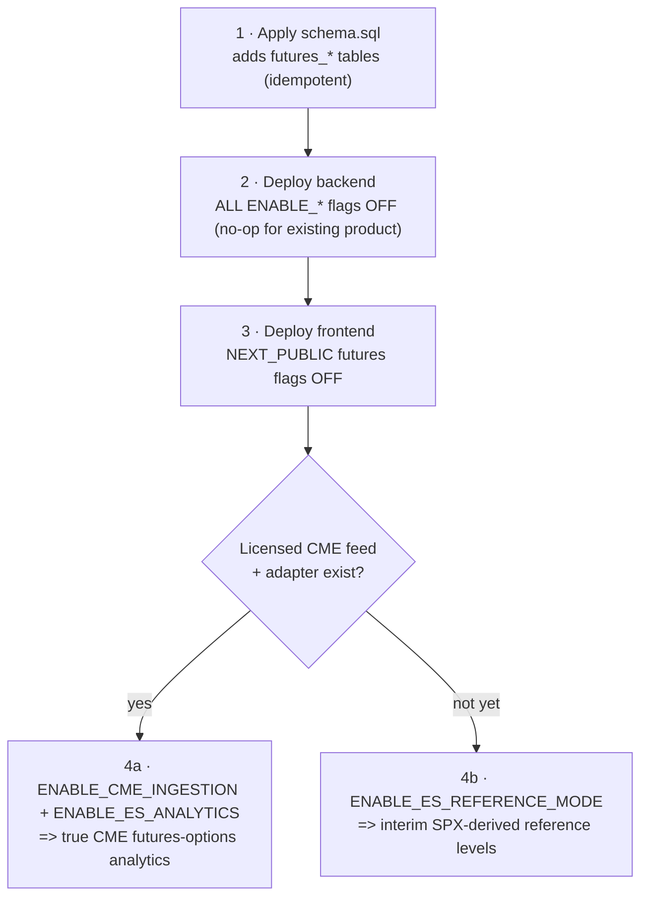

# Futures Support — Deployment, Ingestion & Rollback

This document covers how to ship the ES/NQ feature safely: the **deployment
order**, the **feature-flag matrix**, the **ingestion abstraction** and its
intentionally-pending real adapter, the **external dependencies** that gate true
analytics, and **rollback**.

See [futures-support-architecture.md](./futures-support-architecture.md) for the
big picture.

> **The headline:** deploying this code is a **no-op** for the existing
> SPY/SPX/QQQ/NDX product. All flags default OFF, and no true ES/NQ analytics
> can serve until a **licensed CME feed + adapter** are wired.

---

## 1. Deployment order



1. **Apply `setup/database/schema.sql`.** Adds the `futures_products`,
   `futures_contracts`, `futures_option_series`, `futures_option_contracts`
   tables. Idempotent (`CREATE ... IF NOT EXISTS`) — safe to re-run.
2. **Deploy the backend** with all `ENABLE_*` flags **OFF**. This is a no-op for
   the existing product; the registry defines ES/NQ but reports them unavailable.
3. **Deploy the frontend** with the `NEXT_PUBLIC_*` futures flags **OFF**.
4. **When a licensed CME feed + adapter exist**, either:
   - enable `ENABLE_CME_INGESTION` **+** `ENABLE_ES_ANALYTICS` for **true**
     analytics, **or**
   - enable `ENABLE_ES_REFERENCE_MODE` for interim SPX-derived levels.

Steps 1–3 can ship immediately; step 4 is gated on the external dependencies in
§4.

---

## 2. Feature-flag matrix

### Backend (`src/config.py`)

| Flag | Default | Effect |
| --- | --- | --- |
| `ENABLE_CME_INGESTION` | `false` | Master switch for the CME ingestion pipeline |
| `ENABLE_ES_ANALYTICS` | `false` | True ES futures-options analytics (needs the feed **and** `ENABLE_CME_INGESTION`) |
| `ENABLE_NQ_ANALYTICS` | `false` | True NQ futures-options analytics (needs the feed **and** `ENABLE_CME_INGESTION`) |
| `ENABLE_ES_REFERENCE_MODE` | `false` | Interim SPX-derived ES reference levels |
| `ENABLE_NQ_REFERENCE_MODE` | `false` | Requested-only; stays inert (no NDX source wired) |
| `FUTURES_RISK_FREE_RATE` | `RISK_FREE_RATE` | Black-76 rate (independently overridable) |
| `FUTURES_DEALER_SIGN_POLICY` | `v1_calls_long_puts_short` | Dealer-sign policy version |
| `FUTURES_REFERENCE_MAX_SKEW_MS` | `2000` | Max ES↔SPX quote skew before the basis is rejected |
| `CME_HOLIDAYS` | (defaults) | Operator-supplied CME full-closure dates (comma ISO) |
| `CME_EARLY_CLOSE_DATES` | (defaults) | Operator-supplied CME early-close dates (comma ISO) |

**Defense in depth:** true ES analytics require **both**
`ENABLE_CME_INGESTION` **and** `ENABLE_ES_ANALYTICS`. Flipping one without the
other never half-enables a product. The flags are read live by
`src/instruments.py` and the API routers, so `GET /api/instruments` reflects the
current env without a restart.

### Frontend (`NEXT_PUBLIC_*`, inlined at build)

| Flag | Effect |
| --- | --- |
| `NEXT_PUBLIC_ENABLE_FUTURES_ANALYTICS` | Enables true-analytics surfaces for available futures |
| `NEXT_PUBLIC_ENABLE_ES_REFERENCE_MODE` | Enables the ES reference overlay |
| `NEXT_PUBLIC_ENABLE_NQ_REFERENCE_MODE` | Requested-only; inert (no NDX source) |

The frontend can call `setServerAvailability()` with the
`GET /api/instruments` payload so the **server's** runtime state wins over
build-time flags.

---

## 3. Ingestion abstraction (`src/futures/providers.py`)

The ingestion layer is defined as **vendor-neutral Protocols** plus **offline
fixtures**. **No real CME feed is contacted here.** The concrete `*Fixture*`
providers replay deterministic sample data so the pipeline, persistence, health
plumbing and tests all work end-to-end without licensed market data.

### Provider protocols (what a real adapter must implement)

```python
class FuturesQuoteProvider(Protocol):
    def stream_futures_quotes(self, products) -> AsyncIterator[FuturesQuoteEvent]: ...

class FuturesOptionQuoteProvider(Protocol):
    def stream_option_quotes(self, contracts) -> AsyncIterator[FuturesOptionQuoteEvent]: ...

class FuturesOpenInterestProvider(Protocol):
    async def fetch_open_interest(self, trade_date) -> Sequence[OpenInterestEvent]: ...

class FuturesSettlementProvider(Protocol):
    async def fetch_settlements(self, trade_date) -> Sequence[SettlementEvent]: ...
```

### Normalized events

Every event extends a common `NormalizedEvent` envelope carrying full
provenance: `source`, `received_at`, `exchange_timestamp` (both tz-aware),
`trade_date` (CME), `logical_product` (`ES`/`NQ`), `contract_id`,
`vendor_contract_id`, `sequence`, and a `quality` flag. Concrete records:
`FuturesQuoteEvent`, `FuturesTradeEvent`, `FuturesOptionQuoteEvent`,
`OpenInterestEvent`, `SettlementEvent`. Idempotency is enforced on
`(contract_id, exchange_timestamp, sequence)`.

```python
class DataQualityFlag(str, Enum):
    OK / STALE / CROSSED / SEQUENCE_GAP / SYNTHETIC_FIXTURE  # last never set on a real feed
```

Observability: `IngestionMetrics` (messages received/dropped, sequence gaps,
stale events, reconnects, errors, last event) and `ProviderHealth`
(`provider_id`, `connected`, `real_feed`, `status`, metrics) are surfaced to
`/health` and structured logs.

### The pending real adapter (the guardrail)

```python
REAL_PROVIDER_STATUS = "pending_licensed_cme_adapter"

class RealCMEProviderNotConfigured(RuntimeError): ...

class PendingRealCMEProvider:
    provider_id = "cme_real_pending"
    # every method raises RealCMEProviderNotConfigured; health() reports
    # connected=False, real_feed=True, status=REAL_PROVIDER_STATUS
```

The real, licensed CME/vendor adapter is **intentionally inert**. Every method
raises `RealCMEProviderNotConfigured` so a misconfiguration fails **loudly**
instead of emitting fake ticks. Wiring a fabricated adapter in as if it were
live is explicitly disallowed — production must never silently fall back to
fabricated data. Operators must wire a licensed adapter and flip
`ENABLE_CME_INGESTION` before any real analytics are served.

---

## 4. External dependencies (what gates true analytics)

The feature is the **foundation**; three items are intentionally outstanding.

1. **The licensed CME futures + futures-options data feed and its provider
   adapter are NOT implemented.** Until wired (`PendingRealCMEProvider`), ES/NQ
   true analytics serve **nothing** (no fabrication).
   - **TradeStation may or may not provide CME futures OPTIONS** — this must be
     **confirmed with the vendor**.
   - **CME market-data licensing / redistribution terms apply** and are a
     prerequisite to serving analytics.
2. **The live analytics engine still keys on cash-index symbols.**
   `src/analytics/main_engine.py` computes GEX/Greeks on SPX/NDX etc. Wiring
   `FuturesGexEngine` into the live analytics scheduler and persisting futures
   GEX snapshots is a **follow-up** that requires the real feed.
3. **Dealer-sign calibration for CME is a starting assumption** pending
   validation (see the dealer-sign section of
   [futures-calculations.md](./futures-calculations.md)). It is versioned and
   swappable via `FUTURES_DEALER_SIGN_POLICY`.

Until (1) is resolved, the honest interim option is
`ENABLE_ES_REFERENCE_MODE` (SPX-derived levels, clearly labeled). See
[futures-reference-mode.md](./futures-reference-mode.md).

---

## 5. Rollback

Rollback is **instant** and low-risk:

1. **Set the flags OFF** (backend `ENABLE_*`, frontend `NEXT_PUBLIC_*`). Because
   they are read live on the backend, the futures surfaces immediately report
   unavailable; the existing product is unaffected throughout.
2. **The tables can remain** — they are inert without the flags and the feed, so
   the simplest rollback leaves them in place (harmless).
3. **If you must drop them**, do so in **reverse FK order**:

```sql
DROP TABLE IF EXISTS futures_option_contracts,
                     futures_option_series,
                     futures_contracts,
                     futures_products CASCADE;
```

No existing object references the `futures_*` tables, so dropping them cannot
affect the cash-index/ETF product. Existing `/api/gex/*`, `/api/market/*` and
`/api/max-pain/*` endpoints are unchanged and backward compatible throughout.
