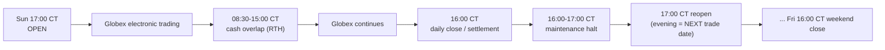

# Futures Market Calendar (CME Globex Equity Index)

This document covers `src/futures/calendar.py` — the first-class CME
equity-index futures calendar (`CMEEquityIndexCalendar`) used for ES / NQ (and
by extension RTY / YM). It is what keeps futures analytics from being filtered
through the 09:30–16:00 ET equity-cash rules.

See [futures-support-architecture.md](./futures-support-architecture.md) for the
big picture.

---

## 1. Why a separate CME calendar

The existing `src/market_calendar.py` models the US **equity cash session** and
has *display-only* CME session helpers (Sun 18:00 ET → Fri 17:00 ET) but:

- no CME holidays,
- no Chicago-time handling,
- no session labels,
- no 0DTE-by-exact-timestamp classification.

`CMEEquityIndexCalendar` adds all of these so futures analytics use the real
Globex session, not equity hours.

Times are resolved in **America/Chicago** (CME's home timezone) using the stdlib
`zoneinfo`, so DST transitions are handled correctly for both Chicago and New
York. `CALENDAR_ID = "cme_equity_index"`.

---

## 2. Session model (Chicago time)



- **Trading:** Sun 17:00 CT → Fri 16:00 CT.
- **Daily maintenance halt:** 16:00–17:00 CT every trading day.
- **Trade date rolls at 17:00 CT** — the evening session (17:00 CT onward)
  belongs to the **next** calendar trading day.
- **RTH / cash overlap:** 08:30–15:00 CT (aligns with the US cash session
  09:30–16:00 ET), surfaced as a distinct label for cash-session-sensitive
  analytics.

Internal time constants: `_REOPEN = 17:00`, `_DAILY_CLOSE = 16:00`,
`_RTH_OPEN = 08:30`, `_RTH_CLOSE = 15:00`, `_DEFAULT_EARLY_CLOSE = 12:00`.

### Session labels

```python
class SessionLabel(str, Enum):
    GLOBEX = "globex"              # normal electronic trading (outside cash overlap)
    CASH_OVERLAP = "cash_overlap" # RTH overlap with the US cash session
    MAINTENANCE = "maintenance"   # daily 16:00-17:00 CT halt
    CLOSED = "closed"             # weekend / holiday
    EXPIRING = "expiring"         # a tracked option/future expires this trade date
```

`get_session(dt)` returns a `MarketSessionState(label, is_open, trade_date)`.

---

## 3. Trade date

`get_trade_date(dt)` (and internal `_trade_date_ct`) computes the CME **trade
date** an instant belongs to:

- rolls at **17:00 CT** (evening session → next day),
- rolls forward over the **weekend** gap so a Friday-evening or weekend
  timestamp maps to the upcoming Monday.

Holidays are deliberately **not** rolled here — the nominal trade date may land
on a holiday so `is_trading()` can detect the closure via
`is_holiday(trade_date)`; rolling past it would make every holiday look
tradable.

---

## 4. Session-state API

```python
cal = CMEEquityIndexCalendar()               # or DEFAULT_CME_CALENDAR

cal.is_holiday(d) -> bool
cal.is_early_close(d) -> bool
cal.get_trade_date(dt) -> str                # "YYYY-MM-DD"
cal.is_maintenance_window(dt) -> bool        # 16:00-17:00 CT
cal.is_trading(dt) -> bool
cal.get_session(dt) -> MarketSessionState
cal.get_session_open(trade_date) -> datetime   # 17:00 CT prior evening
cal.get_session_close(trade_date) -> datetime  # 16:00 CT (or 12:00 early close)
cal.get_settlement_window(trade_date) -> Optional[DateRange]  # 16:00-17:00 CT; None on holidays
```

`is_trading()` accounts for the weekend gap (Fri 16:00 CT → Sun 17:00 CT), the
daily maintenance halt, holidays, and the truncated day portion of an
early-close trade date.

Instances read holiday overrides from the environment **once at construction**,
so a long-running worker sees a stable calendar; a tool that mutates env after
import should construct a fresh instance. All methods require an **explicit**
`datetime` (no implicit clock), keeping the module deterministic under test —
naive datetimes are treated as UTC before conversion to Chicago time.

---

## 5. DTE classification (exact instant, CME trade date)

```python
cal.classify_dte(now, expiration) -> int   # whole CME trade-days; 0 == 0DTE; never negative
cal.is_zero_dte(now, expiration) -> bool    # expires on current trade date AND still in the future
```

Both use the **exact expiration instant** and the **CME trade date** of each
instant — **not** a naive calendar-day subtraction. So an overnight timestamp is
correctly bucketed against the session it trades in, and an option that already
settled earlier today is treated as *expired*, not 0DTE.

---

## 6. Holidays and early closes (operator-supplied)

**CME holidays differ from the NYSE calendar.** They are **operator-supplied**
via environment variables using the same comma-separated ISO format as
`NYSE_HOLIDAYS`:

- `CME_HOLIDAYS` — full-closure dates.
- `CME_EARLY_CLOSE_DATES` — half-day (12:00 CT) closes.

The module ships a **documented default set** for the near-term window as a
convenience — **not** a multi-decade source of truth. Env values are unioned on
top of the defaults (`defaults | env`). Authoritative dates should always be
supplied by the operator.

Documented default holidays: New Year's Day, Good Friday, Memorial Day,
Juneteenth, Independence Day, Labor Day, Thanksgiving, Christmas (for 2025 and
2026). Documented default early closes: July 3, Black Friday (day after
Thanksgiving), Christmas Eve (for 2025 and 2026).

> Because CME and NYSE holiday/early-close calendars diverge, do **not** reuse
> the equity `NYSE_HOLIDAYS` set for futures. Populate `CME_HOLIDAYS` /
> `CME_EARLY_CLOSE_DATES` from an authoritative CME source for the deployment
> window.
