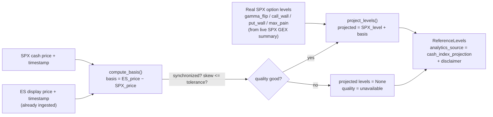

# Futures Reference Mode (Interim SPX-Derived ES Levels)

This document covers `src/futures/reference_mode.py` and the
`GET /api/futures/reference-levels` endpoint — the **interim** mechanism for
showing ES levels **before** a licensed CME futures-options feed exists.

> ## The one rule that matters most
>
> **Reference mode is NOT true ES futures-options analytics. Never present an
> SPX-derived number as ES GEX.**
>
> Every reference-mode result is tagged `analytics_source =
> "cash_index_projection"` and carries the disclaimer:
> *"SPX-derived ES reference — not calculated from ES futures options."*

This is the third of the three analytics kinds described in
[futures-support-architecture.md](./futures-support-architecture.md):

1. True CME futures-options analytics (`cme_futures_options`) — real, pending a feed.
2. Cash-index / ETF OPRA analytics (`opra_equity_options`) — the existing product.
3. **SPX-derived ES reference (`cash_index_projection`) — this document.**

---

## 1. What it does

Reference mode maps **real** SPX cash-index option-derived levels (gamma flip,
walls, max pain, …) onto the ES futures price scale using a **synchronized
additive basis**:

```
basis            = ES_futures_price − SPX_cash_price     (synchronized)
projected_ES_lvl = SPX_level + basis
```

It reuses SPX analytics that **already exist and are real** — it invents no new
market data. What it produces is a *reference overlay* on the ES price axis, not
a computation from ES options. The gamma structure is still SPX's.



---

## 2. Synchronization and quality gating

A stale or unsynchronized basis must never be silently used.
`compute_basis(...)` returns `quality_status = "unavailable"` (and a `None`
basis) when:

- the source (SPX) price is missing or non-positive,
- the target (ES) price is missing or non-positive,
- a source/target timestamp is missing, or
- the two quote timestamps are further apart than `max_skew_ms`
  (default `DEFAULT_MAX_SKEW_MS = 2000.0`, configurable via
  `FUTURES_REFERENCE_MAX_SKEW_MS`).

The basis timestamp is anchored to the **later** of the two quotes. When the
basis is unusable, **every** projected level is `None` and the quality is
propagated — the caller must render an explicit unavailable state, never a
misleading number.

Result objects:

```python
@dataclass(frozen=True)
class BasisResult:
    source_symbol / target_symbol / target_contract
    basis / basis_timestamp
    source_price / target_price / source_timestamp / target_timestamp
    timestamp_skew_ms
    quality_status / quality_reasons
    # is_usable == quality_status == "good" and basis is not None

@dataclass(frozen=True)
class ReferenceLevels:
    analytics_source            # always "cash_index_projection"
    source_symbol / target_symbol / target_contract
    basis / basis_timestamp / source_timestamp / target_timestamp
    timestamp_skew_ms
    quality_status / quality_reasons
    projected_levels: Dict[str, Optional[float]]
    disclaimer = "SPX-derived ES reference — not calculated from ES futures options"
```

---

## 3. Public API (module)

```python
reference_source_for(target_symbol) -> Optional[str]   # ES -> "SPX", NQ -> None
compute_basis(*, source_symbol, target_symbol, source_price, source_timestamp,
              target_price, target_timestamp, target_contract=None,
              max_skew_ms=2000.0) -> BasisResult
project_levels(source_levels, basis) -> ReferenceLevels
build_reference_levels(*, target_symbol, source_levels, source_price,
                       source_timestamp, target_price, target_timestamp,
                       target_contract=None, max_skew_ms=2000.0) -> ReferenceLevels
```

`build_reference_levels()` is the end-to-end helper: it validates the pair,
computes the basis, and projects the levels.

---

## 4. The NQ guard (no naive QQQ→NQ)

`reference_source_for()` returns:

- `ES → "SPX"` (the only wired pair),
- `NQ → None`.

A naive QQQ→NQ additive mapping is **explicitly forbidden**. NQ reference mode
would require a cash-index source (NDX) that is not yet wired. Therefore:

- `build_reference_levels(target_symbol="NQ", ...)` **raises `ValueError`** —
  the caller must not fall back to a naive mapping.
- In the registry, NQ's `reference_source_symbol` is `None`, so NQ reference
  mode stays unavailable even if `ENABLE_NQ_REFERENCE_MODE` is set (the reason
  is surfaced in availability/`known_limitations`).

---

## 5. API: `GET /api/futures/reference-levels`

Query parameters: `source=SPX`, `target=ES`, `contract=front`.

Behavior (`src/api/routers/futures.py`):

1. 404 if `target` is unknown or not a future.
2. **409** `reference_mode_unavailable` if the target's reference mode is not
   enabled or has no wired source — an honest error: the feature exists but is
   off / unsourced, with `reasons`.
3. 400 if the requested `source` does not match the target's wired source.
4. Otherwise: reads the **real** latest SPX GEX summary and the ES display price
   already ingested (ES bars are stored keyed by the cash-index symbol, SPX),
   extracts the source levels (`gamma_flip`, `call_wall`, `put_wall`,
   `max_pain`), resolves the ES contract label for provenance, and returns the
   projected levels.

When inputs are missing or unsynchronized, the response carries
`quality_status = "unavailable"` and `projected_levels` of `None` rather than a
misleading number. The response always includes `analytics_source`, `basis`,
timestamps, `timestamp_skew_ms`, `quality_status`, `quality_reasons`,
`projected_levels`, and the `disclaimer`.

Example (shape only):

```json
{
  "analytics_source": "cash_index_projection",
  "source_symbol": "SPX",
  "target_symbol": "ES",
  "target_contract": "ESZ25",
  "basis": 34.25,
  "basis_timestamp": "2026-07-28T14:32:01+00:00",
  "timestamp_skew_ms": 180.0,
  "quality_status": "good",
  "quality_reasons": [],
  "projected_levels": { "gamma_flip": 6034.25, "call_wall": 6134.25, "put_wall": 5934.25, "max_pain": 6009.25 },
  "disclaimer": "SPX-derived ES reference — not calculated from ES futures options"
}
```

---

## 6. UI obligations

Any surface that renders reference-mode levels **must**:

- label them as SPX-derived reference (never as ES GEX),
- show the disclaimer,
- render an explicit unavailable state when `quality_status != "good"`.

The frontend registry distinguishes `trueAnalytics` from `referenceMode` in
`InstrumentAvailability` precisely so the UI can label the two honestly. Gating
is driven by `NEXT_PUBLIC_ENABLE_ES_REFERENCE_MODE` (and, if ever sourced,
`NEXT_PUBLIC_ENABLE_NQ_REFERENCE_MODE`), reconcilable with the server via
`GET /api/instruments`.
