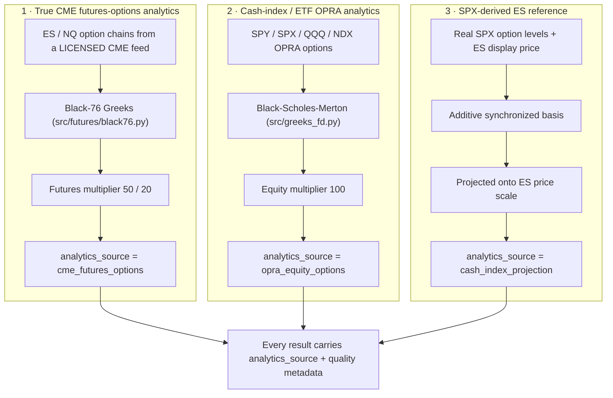

# First-Class ES/NQ Futures Support — Architecture

Status: **implemented, feature-flagged OFF by default**. Deploying this code is a
no-op for the existing SPY/SPX/QQQ/NDX product until an operator explicitly
enables the flags **and** a licensed CME feed is wired.

This is the top-level document for the first-class CME equity-index futures
(ES / NQ) feature. It explains what the feature is, what it deliberately is
**not** yet, how the pieces fit together, and where the remaining external
dependencies sit. The companion documents drill into each area:

| Document | Scope |
| --- | --- |
| [futures-data-model.md](./futures-data-model.md) | Instrument registry, futures domain objects, DB tables, security definitions |
| [futures-calculations.md](./futures-calculations.md) | Black-76 pricing/Greeks, futures GEX engine, dealer-sign policy |
| [futures-market-calendar.md](./futures-market-calendar.md) | CME Globex session model, trade-date roll, holidays, 0DTE classification |
| [futures-reference-mode.md](./futures-reference-mode.md) | Interim SPX-derived ES reference levels (cash-index projection) |
| [futures-deployment.md](./futures-deployment.md) | Deployment order, feature flags, rollback, external dependencies |
| [futures-testing.md](./futures-testing.md) | Test suites and commands, backend + frontend |

---

## 1. The three-way analytics distinction (read this first)

Everything in this feature exists to keep three fundamentally different kinds of
number **separate and honestly labeled**. This distinction is repeated in every
document because conflating any two of them would be a correctness and
credibility failure.

- **True CME futures-options analytics** (`cme_futures_options`) — genuine
  gamma exposure computed from ES/NQ **futures options** using Black-76 Greeks
  and the futures contract multiplier (50 for ES, 20 for NQ). This is the real
  thing, and it currently serves **nothing** because the licensed CME data feed
  is not yet wired (see §6).
- **Cash-index / ETF OPRA analytics** (`opra_equity_options`) — the existing,
  unchanged product for SPY/SPX/QQQ/NDX, computed with Black-Scholes-Merton and
  the equity multiplier 100.
- **SPX-derived ES reference** (`cash_index_projection`) — an **interim**
  convenience that projects *real SPX* option-derived levels onto the ES price
  scale via a synchronized basis. It is explicitly **not** ES futures-options
  GEX and must never be presented as such. See
  [futures-reference-mode.md](./futures-reference-mode.md).

> **Never present an SPX-derived number as ES GEX.** The reference-mode result
> is always tagged `analytics_source = "cash_index_projection"` and carries the
> disclaimer *"SPX-derived ES reference — not calculated from ES futures
> options"*.

---

## 2. Existing architecture (preserved, unchanged)

ZeroGEX is a **FastAPI backend** (`zerogex-oa`) plus a **Next.js frontend**
(`zerogex-web`). The futures work is strictly additive to that stack:

- **Data vendor: TradeStation only.** No new vendor is added by this feature.
- **Postgres via raw SQL.** Schema lives in `setup/database/schema.sql`, applied
  idempotently (`CREATE ... IF NOT EXISTS`). There is no Alembic; the futures
  tables follow the same convention.
- **GEX convention** = *dollar gamma per 1% move*:
  `gamma * OI * 100 * S^2 * 0.01`, calls positive, puts negative. Previously the
  `100` multiplier was hardcoded in ~9 sites.
- **Equity Greeks** are Black-Scholes-Merton (`src/greeks_fd.py`,
  `src/ingestion/greeks_calculator.py`) — **not** Black-76.
- **Config** is a flat, env-driven module (`src/config.py`); there is no pydantic
  `BaseSettings`.
- **Market calendar** (`src/market_calendar.py`, pytz) had display-only CME
  session helpers but no CME holidays and no Chicago-time session labels.

### What "futures support" used to mean (display-only)

Before this feature, "futures" support was **display-only**: during the
overnight session the cash-index quote (SPX/NDX) was swapped for its continuous
future (`@ES`/`@NQ`) via a `futures_quotes` table keyed by the **index** symbol.
GEX, Greeks and signals were **never** keyed on ES/NQ — they always ran on the
cash-index symbol. That plumbing is untouched and still works; the new
`futures_*` tables are independent of it.

---

## 3. What was added (all additive, all flag-gated OFF by default)

Everything below lives under `src/futures/` plus the new registry
(`src/instruments.py`), two API routers, and the frontend registry. The equity
product's calculations are byte-for-byte unchanged.

| Module | Responsibility |
| --- | --- |
| `src/instruments.py` | Centralized instrument registry — asset class, analytics source, calendar, economics, capabilities, and **runtime availability** resolved from feature flags |
| `src/futures/contracts.py` | Frozen-dataclass domain model: `FuturesProduct`, `FuturesContract`, `FuturesOptionSeries`, `FuturesOptionContract`; month codes; decimal-safe economics |
| `src/futures/security_definitions.py` | `FuturesSecurityDefinitionProvider` Protocol + `MockFuturesSecurityDefinitionProvider` fixture; SOQ expiration helpers; idempotent upserts |
| `src/futures/resolver.py` | `ContractResolver` — continuous → dated contract resolution + roll policy (calendar/volume/OI/hybrid) |
| `src/futures/calendar.py` | `CMEEquityIndexCalendar` — Globex session model, trade-date roll, holidays, DST-safe 0DTE classification |
| `src/futures/black76.py` | Black-76 pricing + Greeks for options **on futures** (not spot) |
| `src/futures/sign_policy.py` | `DealerPositionSignPolicy` Protocol, versioned; default + inverted calibrations |
| `src/futures/gex.py` | `FuturesGexEngine` — contract-aware, multiplier-aware GEX with full provenance metadata |
| `src/futures/providers.py` | Vendor-neutral ingestion Protocols + offline fixtures; `PendingRealCMEProvider` guardrail |
| `src/futures/reference_mode.py` | Interim SPX-derived ES reference levels (cash-index projection) |
| `src/api/routers/instruments.py` | `GET /api/instruments`, `/api/instruments/{symbol}` |
| `src/api/routers/futures.py` | `GET /api/futures/{product}/contracts`, `/roll-state`, `/reference-levels` |
| `core/instruments/registry.ts` + `formatting.ts` (frontend) | Mirror registry + instrument-aware price/notional formatting |

### Instruments in the registry

| Symbol | Asset class | Multiplier | Tick | Analytics source | Calendar | Reference source |
| --- | --- | --- | --- | --- | --- | --- |
| SPY | etf | 100 | — | `opra_equity_options` | `us_equities` | — |
| SPX | index | 100 | — | `opra_equity_options` | `us_cash_index` | — |
| QQQ | etf | 100 | — | `opra_equity_options` | `us_equities` | — |
| NDX | index | 100 | — | `opra_equity_options` | `us_cash_index` | — |
| **ES** | future | **50** | 0.25 | `cme_futures_options` | `cme_equity_index` | **SPX** |
| **NQ** | future | **20** | 0.25 | `cme_futures_options` | `cme_equity_index` | **None** |

ES and NQ are **always defined** (so the API can describe them) but their
analytics/reference availability is gated by feature flags.
`effective_capabilities()` intersects the static capability surface with runtime
availability, so an unavailable future never *looks* fully operational.
`strategy_builder` and `signals` stay **OFF** for futures — they assume
equity-option symbology / calibration and were not recalibrated for CME.

NQ has **no wired reference source**: a naive QQQ→NQ additive mapping is
explicitly disallowed, and an NDX-derived projection is pending. So NQ reference
mode stays unavailable regardless of its flag.

---

## 4. End-to-end data flow (target architecture)

This is the intended pipeline once a **licensed CME feed** exists. Today the
"CME feed → provider adapter" edge is the `PendingRealCMEProvider` guardrail —
it raises rather than emitting fabricated ticks.

```mermaid
flowchart LR
    FEED["Licensed CME feed<br/>(futures + futures options)<br/>PENDING adapter"]
    TS["TradeStation<br/>(existing quotes / cash-index)"]

    FEED -->|"providers.py Protocols<br/>(quotes, option quotes, OI, settlement)"| ING["Ingestion<br/>normalized events"]
    FEED -->|"security definitions"| SECDEF["security_definitions.py<br/>products / contracts / series / option contracts"]

    ING --> DB[("Postgres<br/>futures_products<br/>futures_contracts<br/>futures_option_series<br/>futures_option_contracts")]
    SECDEF -->|"idempotent upserts"| DB

    DB --> RES["resolver.py<br/>continuous ES → dated contract (ESZ25)"]
    RES --> B76["black76.py<br/>price / delta / gamma / vega / theta / vanna / charm"]
    B76 --> GEX["gex.py FuturesGexEngine<br/>GEX = sign · gamma · OI · mult(50/20) · F² · 0.01"]
    GEX -->|"result + provenance metadata"| API["API routers<br/>/api/instruments, /api/futures/*"]
    API --> FE["Frontend registry + UI<br/>core/instruments/*"]

    TS -.->|"SPX option levels + ES display price"| REF["reference_mode.py<br/>cash_index_projection"]
    REF -.-> API
```

The dotted path is the **interim reference mode**, which does not depend on the
CME feed — it reuses real SPX analytics that already exist.

---

## 5. Feature flags

All default **False**. See [futures-deployment.md](./futures-deployment.md) for
the enable/rollback matrix.

Backend (`src/config.py`, read live by `src/instruments.py` and the routers):

- `ENABLE_CME_INGESTION` — master switch for the CME ingestion pipeline.
- `ENABLE_ES_ANALYTICS` — true ES futures-options analytics (needs the feed).
- `ENABLE_NQ_ANALYTICS` — true NQ futures-options analytics (needs the feed).
- `ENABLE_ES_REFERENCE_MODE` — interim SPX-derived ES reference levels.
- `ENABLE_NQ_REFERENCE_MODE` — requested-only; stays inert (no NDX source wired).
- `FUTURES_RISK_FREE_RATE` — Black-76 rate (defaults to the equity `RISK_FREE_RATE`).
- `FUTURES_DEALER_SIGN_POLICY` — dealer-sign policy version (default `v1_calls_long_puts_short`).
- `FUTURES_REFERENCE_MAX_SKEW_MS` — max ES↔SPX quote skew before the basis is rejected (default 2000).
- `CME_HOLIDAYS`, `CME_EARLY_CLOSE_DATES` — operator-supplied CME calendar dates.

True ES analytics require **both** `ENABLE_CME_INGESTION` and
`ENABLE_ES_ANALYTICS` (defense in depth — flipping one without the other never
half-enables a product).

Frontend (`NEXT_PUBLIC_*`, inlined at build):

- `NEXT_PUBLIC_ENABLE_FUTURES_ANALYTICS`
- `NEXT_PUBLIC_ENABLE_ES_REFERENCE_MODE`
- `NEXT_PUBLIC_ENABLE_NQ_REFERENCE_MODE`

The frontend registry can be reconciled against the server via
`GET /api/instruments` (`setServerAvailability()`), so the server's runtime state
wins over build-time flags.

---

## 6. External dependencies and remaining work

This feature builds the **foundations**. Three things are intentionally
outstanding and must be understood before enabling anything:

1. **The real, licensed CME data feed + provider adapter are NOT implemented.**
   `PendingRealCMEProvider` raises `RealCMEProviderNotConfigured` on every
   method call — production must never silently fall back to fabricated data.
   Until a licensed adapter is wired, ES/NQ **true analytics serve nothing**
   (no fabrication).
   - Whether **TradeStation** can provide CME futures **options** must be
     **confirmed with the vendor**. CME market-data licensing/redistribution
     terms apply and are a prerequisite.
2. **The live analytics engine still keys on cash-index symbols.**
   `src/analytics/main_engine.py` computes GEX/Greeks on SPX/NDX etc. Wiring
   `FuturesGexEngine` into the live analytics scheduler and persisting futures
   GEX snapshots is a **follow-up** that requires the real feed.
3. **Dealer-sign calibration for CME is a starting assumption.** The default
   `v1_calls_long_puts_short` policy mirrors the equity baseline and is flagged
   as a *starting* calibration pending validation against real CME positioning.
   The policy is versioned, echoed in GEX metadata, and independently swappable.

Because of (1)–(3), enabling `ENABLE_ES_ANALYTICS` without a licensed feed does
nothing useful; the honest interim option is `ENABLE_ES_REFERENCE_MODE`, which
serves SPX-derived reference levels clearly labeled as such.

---

## 7. Design rules honored

- **Additive & backward compatible** — no existing calculation changes; the
  registry is a new lookup layer, not a rewrite.
- **Security-definition metadata is authoritative** — exact expiration instants,
  multipliers, exercise/settlement style and the underlying future an option
  settles into come from the security definition, never parsed from a display
  ticker at runtime.
- **No fabricated production data** — fixtures are marked `SYNTHETIC_FIXTURE`;
  the real adapter is a loud guardrail.
- **Honest availability** — an unavailable future is described but never made to
  look operational; capability × availability intersection drives the UI.
- **Cross-maturity mixing is explicit** — options on different maturities are
  never blindly summed; `aggregate_by_underlying()` is the only seam that
  combines them, and it does so per dated contract.
